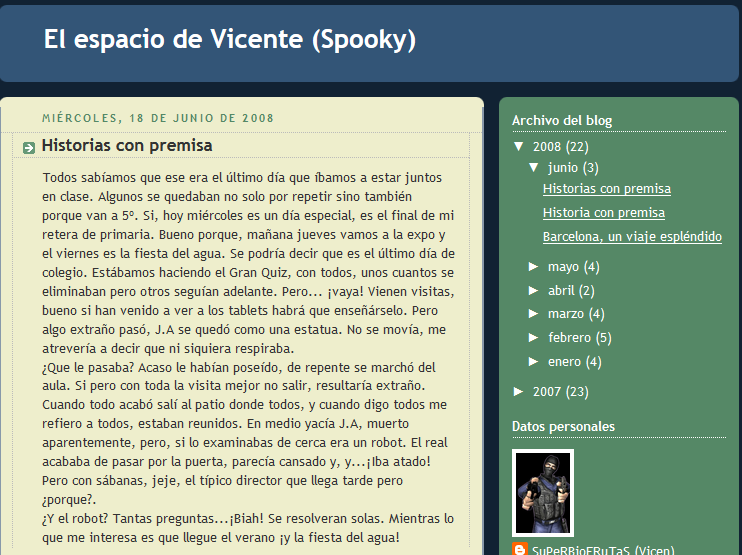

# 1.1 Blogs educativos

###  **BLOGS EDUCATIVOS **

Dentro de la variedad de blogs que hemos visto, nosotros nos vamos a **centrar** en lo diferentes ejemplos que encontramos de **blogs educativos**. Hoy en dia muchos compañeros tanto de primaria como se secundaria que  ya los utilizan con éxito y lo implementan de una u otra forma en sus aulas. 

Como **características** generales del uso del blog **en educación** destacamos brevemente las siguientes:

*   Fomentan la **comunicación** entre alumno y profesor.
*   Establecen un **entorno de aprendizaje común y colaborativo.**
*   Dotan al alumno de **herramientas diferentes** para el aprendizaje.
*   Amplían el tiempo de **aprendizaje** que se extiende **más allá del tiempo del aula.**
*   Ayudan a desarrollar **respeto** por las composiciones y creaciones ajenas.
*   Son un elemento **motivador** de aprendizaje.
*   Permite la comunicación **bidireccional** entre alumnos y profesores.
*   Convierte al alumno en parte **activa** de la asignatura.
*   Desarrolla el **pensamiento crítico** del alumno.
*   Es un componente importante en el desarrollo de la competencia **"aprender a aprender"**
*   Crean un vínculo entre **escuela y familias.**

Dentro de esta categoria de **"blogs educativos"** podemos establecer ciertas **subcategorias,** dependiendo del uso que le demos, o el enfoque con el que queramos utilizarlo en el aula.

Aunque podriamos decir que habrá tantos tipos de blogs educativos como docentes dispuesto a crearlos, proponemos esta clasificación: **Blogs de aula, Blogs del alumno, blogs de colegio y blogs de área.**

A continuación te mostramos ejemplos significativos de usos del blog en el aula de Primaria y Secundaria, realizados por compañeros.

### **BLOGS DE AULA**

Son aquellos en los que sirven para **gestionar una tutoria**. Punto de **encuentro** entre los alumnos, el tutor y la familia.Es quizás el más utilizado en el ámbito educativo. A veces no pasa de ser la página personal del profesorado, pero también puede ser un **complemento a las clases**, un lugar donde colgar los deberes, mostrar los trabajos y composiciones de los alumnos a través de videos, fotos...

[Blog de tercero de primaria de Binaced (CRA EL TREBOL)](http://tercerobinaced.blogspot.com.es/)

### **BLOGS DEL ALUMNO**

En algunos colegios se ha desarrollado la experiencia de que cada alumno posea un blog propio en el que cree sus **propias composiciones** para las diferentes áreas. A modo de diario individual, sobre sus intereses e inquietudes, aficiones, actividades, …, etc. De libre elección por los alumnos, cuidando las actitudes de respeto , y citando los recursos utilizados. Y también participar en las **blogs** **de compañeros/as,** comentando sus artículos y haciendo aportaciones, propuestas, etc.

[Blog de alumno (CRA ARIÑO-ALLOZA)](vicentearino.blogspot.com)

### BLOGS DE COLEGIO  

Aquellos que a través de diversos formatos, como el de **periodico digital** o incluso **página web** del colegio, sirven de **encuentro** de la **comunidad educativa.** Aquí aprovecharíamos la potencia de los blogs en cuanto a gestión de archivos multimedia, propios o referenciados desde almacenes de contenidos (Flickr, Odeo, Youtube…).

[Periódico Escolar Cra Ariño-Alloza](ARININOS2.blogspot.com)

              
[Blog del colegio Alfonso I de Tauste](http://www.catedu.es/arablogs/blog.php?id_blog=2395)

### BLOGS DE ÁREA  

Es el que nos ocupa en este módulo. Utilizado para **desarrollar, ampliar  o apoyar** diferentes áreas del curriculo.

[Blog de religión (CEIP MONZON 3)](http://www.divertireli.blogspot.com)

