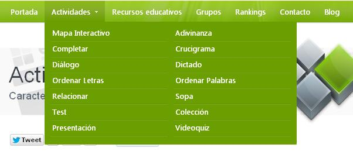
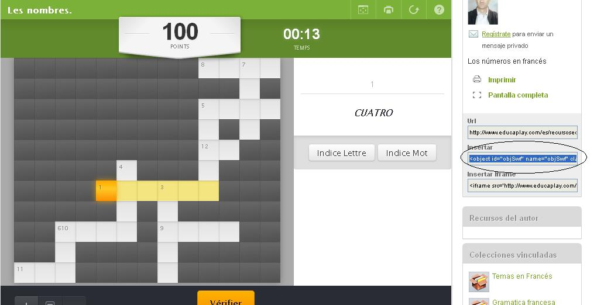

# 1.1 Educaplay

[Educaplay](http://www.educaplay.com/) es un proyecto desarrollado para la **creación de actividades interactivas** que, poco a poco, se ha convertido en un lugar  de referencia tanto para la creación de actividades  asi como de **repositorio de cualquier materia** útiles para nuestras clases. En Educaplay se elaboran materiales de **forma online** y quedan en la plataforma para **compartirlos** con el resto del profesorado.

**La plataforma** permite crear actividades educativas multimedia con un resultado **atractivo y profesional**, como mapas, adivinanzas, crucigramas, diálogos  dictados, ordenar letras y palabras, relacionar, sopa de letras y tests. Otra característica muy importante es que nos nos **permite embeber** las actividades en nuestros **blogs o páginas web**, una buena alternativa para que los estudiantes aprendan jugando. Las actividades se pueden elaborar con enunciados de texto, imagen y audio, lo cual de un abanico interesante de posibilidades.

La siguiente presentación nos resume **qué es** y para qué podemos utilizar Educaplay.

https://www.youtube.com/watch?v=bac-Lm0awI8

### TIPOS DE ACTIVIDADES

Para utilizar Educaplay hay que registrarse. Con el usuario y contraseña creados podrás entrar siempre a cualquiera de las actividades que vayas creando.

Educaplay dispone de un abanico de **12 tipos de actividades** que podemos crear a través de su web. Para acceder a ellas sólo es necesario que cliques en el **menú "Actividades"** y seleccionar el paquete que nos interese.A partir de ahí comienza un **asistente de creación** de actividades muy sencillo que te guia desde el primer paso hasta el último. Además **por cada actividad** que comiences a realizar tienes disponible un **videotutorial formativo.**

### COMPARTIR EN EL BLOG

El último paso para poder **compartir** la actividad en nuestro Blog de aula, es **embeber** el codigo de la actividad en nuestro blog. El código que tenemos que copiar aparece en la parte derecha de la pantalla, con el título **"insertar"**  y es el que permitirá incrustarlo en el blog para que nuestros alumnos lo puedan realizar.

