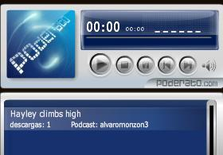
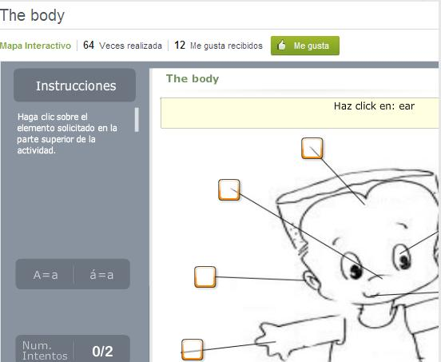

# 1.2.1 Posibilidades didácticas

En este apartado vamos a presentarte algunas de las posibilidades más interesantes de aplicación didáctica que puedes incluir en los blogs. Durante  el resto de los módulos desglosaremos estas herramientas y profundizaremos en su uso y aplicación didáctica.

### **RECURSOS PODCAST**

Los **podcast** nos dan la posibilidad de incluir en nuestro blog enlaces a **audios** con los que podemos trabajar tanto dentro como fuera del aula. En este aspecto, el blog incrementa su valor , puesto que ponemos a disposición de nuestros alumnos materiales de audio con los que trabajar la habilidad de la **escucha** y **comprensión**.

Exiten muchas páginas web en las que encontramos audios adaptados a diferentes niveles. Muchos de ellos contienen actividades didácticas relacionadas, lo cual nos facilita nuestra labor como docente y convierten a un audio en una actividad completa. 

La formasde incluir los podcast o audios en nuestro blog pueden ser varias, dependiendo del proveedor de blogs lo haremos de formas diferentes. Desde la forma más sencilla que es un enlace al podcast, pasando por incluir una zona de audios vinculadas a través de una imagen, texto...

Te invitamos a ver el siguiente **[ejemplo](http://listentrebol.blogspot.com.es/)** en el que el blog tiene una zona específica para trabajar la comprension oral. A través de un enlace en una imagen, llegamos a la zona de [l](http://listentrebol.blogspot.com.es/)istening, donde a parte del audio, el maestro ha colgado el ejercicio relacionado.

 

Otra posibilidad didáctica muy interesante e incluso más motivadora que la anterior, es la de **crear nuestros propios podcast** con nuestros alumnos. De una forma sencilla podemos grabar nuestras propias piezas de audio y colgarlas en nuestro blog. De su aplicación didáctica es importante destacar el valor motivador , puesto que son los protagonistas absolutos de la actividad. Por otra parte, nos permite a los docentes crear un registro de la evolución de nuestros alumnos respecto a los aspectos de **comunicación oral** más importantes como son la **pronunciación**, el **ritmo** y la **fluidez**.

Los programas para grabar los audios son muy sencillos de utilizar. Desde la **grabadora de sonidos de windows**, pasando por otros como **Audacity** y **Cool Edit**, conseguiremos resultados óptimos de una forma rápida e intuitiva. Subir el audio al servidor de podcast será el útimo paso para tener nuestro recurso.

Para insertar nuestros podcast en el blog, utilizaremos el **código embebido** que nos facilite el **servidor de  podcast** elegido.

En el siguiente **[ejemplo](http://monzon3english5.webnode.es/listenings/)** podemos ver como los alumnos interpretan una de las lecturas del libro de texto y el resultado es añadido al blog de área.

### **ACTIVIDADES INTERACTIVAS.**

Otro recurso muy interesante para completar nuestro blog son las **actividades interactivas**. Hoy en día encontramos muchos desarrolladores de actividades educativas. Estos generadores son muy sencillos e intuitivos y nos permiten incorporar en nuestro blog actividades que van más allá del texto plano, y que resultan motivadores tanto en su fondo como en su forma para nuestros alumnos. Encontramos diferentes páginas que nos permiten hacerlo tal y como verás en el transcurso de este curso. **Educaplay**, **Edilim** o **That quiz** son ejemplos de este tipo de actividades.

La forma de incluirlas en nuestro blog suele ser a través de **código embebido**, o también a través de un **enlace simple**. Un código embebido nos permite integrar la actividad completa dentro del entorno de nuestro blog, como si fuera una entrada más. El enlace simplemente nos lleva a través de un hipervínculo a la actividad  en el entorno de la página web del recurso.

Vamos a ver **dos ejemplos**:

En el primero, la actividad interactiva es un **aula virtual**. En este caso hay dos, una para 5º y otra para 6º. La forma en la que está incluida en el blog es un **[enlace en una imagen.](http://monzon3ingles5.blogspot.com.es/)** Cuando los alumnos entran en esa zona, inmediatamente son redireccionados a la **[página del generador,](http://www.thatquiz.org/es/classtest?U3OC8GWH)** es este caso **thatquiz.com**

  
  

 En este [**segundo ejemplo**](http://cosasdepepa.blogspot.com.es/2010/04/adivinanzas-con-educaplay.html), además de encontrar una muy buena descripción de que es una actividad Educaplay, podrás ver la actividad incluida  como parte del blog. En este caso se ha usado un **código embebido** para poder conseguir el resultado.

### **VIDEOS DE YOUTUBE Y PROPIOS**

Los **recursos audiovisuales** son siempre fuente de motivación para nuestros alumnos. Nuestros blogs pueden contener **videos de youtube** u otros servidores de video online, a través de **código embebido**. Esto a parte de darle un aspecto mucho más activo a nuestro blog, facilita tener los contenidos audivisuales i**ntegrados en el contexto de nuestro blog**. De una forma muy sencilla, el vídeo seleccionado pasa a forma parte de nuestro entorno web. 

Otra opción es la posibilidad de crear **nuestros propios videos** y de subirlos a nuestro espacio. En este caso los alumnos tienen el rol  de ser creadores y protagonistas de sus propias producciones audiovisuales, lo que hace que las actividades sean potencialmente más significativas. Además el hecho de que el resultado final de su trabajo, en este caso el vídeo, se pueda ver en el blog dota a la actividad de un valor expositivo que la hace más significativa.

 En el **[primer ejemplo](http://albertomeditutor.blogspot.com.es/2013/11/two-videos-to-think-about.html)** el autor utiliza videos de **youtube** que integra en su blog a través de código embebido.

En este **[segundo ejemplo](http://craarinotelevision.blogspot.com.es/2009/06/au-restaurant-chapitre-2.html)**, los videos son de **producción propia**, y recogen el trabajo de los alumnos durante una unida didáctica del área de francés.

### **ENLACES A PÁGINAS DE INTERÉS.**

Como creadores de nuestro blog, seremos autores de la mayoría de los textos y actividades que inlcuiremos. Sin embargo también podemos incluir **enlaces a otras páginas y blogs** que resulten interesantes para el desarrolo de la unidad o contenido que estamos trabajando.

Ya bien sea en forma de ampliación de contenidos, curiosidades o incluso como ejercicios relacionados o deberes, podemos crear apartados concretos en los que incluyamos los enlaces a otros recursos interesantes. 

La forma de incluir enlaces es sencilla, simplemente **copiando la direccion de la página** en concreto que nos interesa, o **vínculando** esa dirección **a un texto** previamente escrito por nosotros.

En el **[siguiente ejemplo](monzon3ingles5.blogspot.com),** los ejercicios relacionados con la unidad didáctica están **vinculados a un texto propio.**

###  **PRESENTACIONES Y PUBLICACIONES **

Otra herramienta a la que se le puede sacar partido en el área de lenguas extranjeras es a las publicaciones en forma de presentación de **diapositivas o libros virtuales.**

De la misma manera que podiamos compartir los videos de las galerias de youtube o de cualquier servidor online de videos, con estos recursos también podemos dar el paso de convertirnos en **creadores de materiales web 2.0.** Los libros virtuales son una forma sencilla de promover el aprendizaje cooperativo y de crear materiales de aula con y para nuestros alumnos. Hay diversas herramientas que lo facilitan de forma intuitiva y que como todas las herramientas web 2.o permiten ser compartidas en nuestro blog. **Slideshare o Issuu** son dos ejemplos de estas herramientas.

En este **[primer ejemplo](http://clubdeidiomassantaana.wordpress.com/)** vemos una presentación creada a partir de **Slideshare** y que ha sido **embebida en el blog.**

 Otra aplicación que nos permite **crear libros digitales** propios es **ISSUU,** que convierte **archivos pdf** en presentaciones en forma de **libro digital.** Este recurso es muy interesante a la hora de crear producciones conjuntas, hacer recopilación de actividades o como trabajo final en cualquier actividad de trabajo colaborativo.

Además de crear nuestros propios libros, hay un **[gran banco de recursos](http://issuu.com/nsnews/docs/back_to_school__4_2010)** ya creados que podemos utilizar e insertar en nuestros blogs.

###  **OTROS RECURSOS**

La web 2.0 ha generado un **gran número de recursos y aplicaciones web 2.0**. Además de las que te hemos nombrado existen otras que también pueden tener su implementación en el aula de lenguas extranjeras.

Como ejemplo te exponemos **[vokki](http://www.voki.com/),** una herramienta que genera un avatar que es capaz de leer en diferentes lenguas el texto que introducimos.

