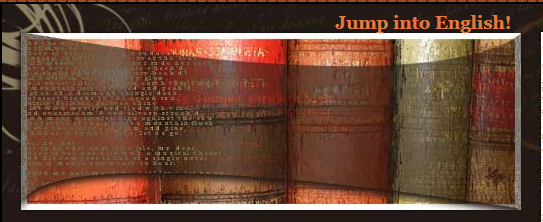
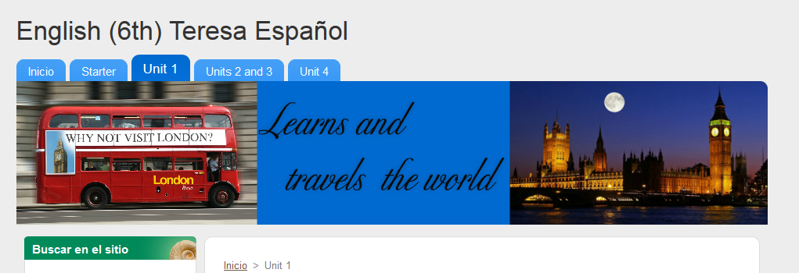
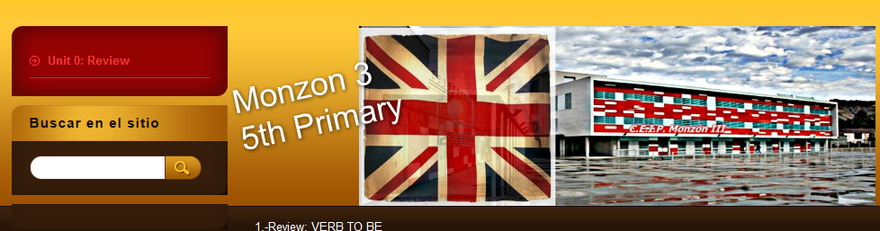
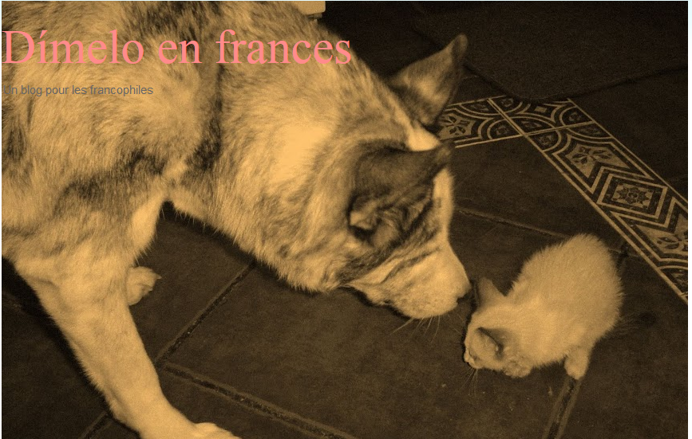
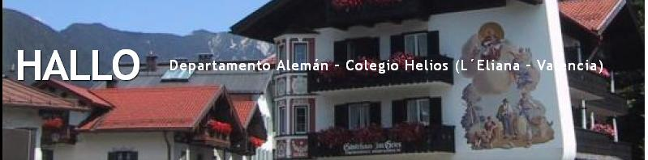

# 1.2 Blogs de lenguas extranjeras

Fig 1.10  [www.dreamstime.com](http://www.google.es/url?sa=i&rct=j&q=&esrc=s&source=images&cd=&cad=rja&docid=BKOmh15bIELdPM&tbnid=inrlllgNBW8zjM:&ved=0CAQQjB0&url=http%3A%2F%2Fwww.dreamstime.com%2Fstock-photography-hello-sphere-word-tiles-global-languages-cultures-different-representing-peace-planet-image31479032&ei=BNCBUouMJrL50gWe0oDwDQ&psig=AFQjCNEcdYspokQgCPhTCj6rbRgRj9053Q&ust=1384325470460696) Licencia Creative Commons

De todas las categoriías, la que nos interesa es la del **blog de área**, en nuestro caso, el blog de **lengua extranjera.**  Tal y como hemos explicado anteriormente, ya son muchos los docentes que lo están aplicando en sus aulas.¿Qué usos son los más comunes?

*   Compartir **multimedias** relacionados con el desarrollo de la competencia lingüística:
    *   youtube
    *   pod cast
    *   grabaciones realizadas por los alumnos
    *   lecturas interactivas con apoyo de audio y vídeo

*   Mostrar **actividades interactivas** para desarrollar tanto dentro como fuera del aula.
*   Ofrecer **enlaces** a otras páginas de interés.
*   Disponer links a **aulas virtuales,** o **actividades 2.0** previamente creadas por el maestro.
*   Motivar al alumnado a través del blog, mostrando una herramienta diferente de **gestionar** la asignatura.

La mejor manera de mostraros las aplicaciones es a través de blogs de compañeros. En este apartado os queremos mostrar **algunos ejemplos** de blogs de lenguas extrajeras, que os pueden servir para ir cogiendo ideas para el blog que vais a desarrollar.

**1.- [Jump into English:](http://www.catedu.es/arablogs/blog.php?id_blog=2399)** Este blog está creado a través **ARABLOGS.** Este es el proveedor de blogs del **Departamento de Educación del Gobierno de Aragón**, que permite crear blogs educativos con una serie de características que explicaremos en la unidad 2. Puedes observar que permite **embeber** videos de youtube, agregar **widgets** como calendarios y crear **menús** de navegación propios en la barra lateral.

Fig 1.11: [Blog: Jump to english](http://www.catedu.es/arablogs/blog.php?id_blog=2399) captura de pantalla

**2.- [English 6th:](http://www.teresa23.webnode.com)** Un blog que incluye el **contenido íntegro** del área de inglés. Se utiliza como **apoyo** en el aula y sigue el orden de las unidades didácticas del material editorial que tienen los alumnos. Además de **facilitar** a los alumnos **resúmenes y esquemas** de la parte gramática, se utiliza para dejar colgados los ejercicios practicos tanto para deberes como para trabajo en el aula.

Fig. 1.12. [Blog: English 6th](http://www.teresa23.webnode.com) captura de pantalla

** 3.- [5th Primary Monzon 3:](monzon3english5.webnode.com)** Sigue la misma filosofía que el blog anterior, pero en este caso nos podemos fijar en la peculiaridad de que incluye enlace a un **"aula virtual"**. Este aula es creada por el maestro responsable de la asignatura a través de una **herramienta web 2.0.** También incluye **enlaces** a elementos **multimedia.**

[1.13: Blog: 5th primary Blog (ceip Monzon 3)](monzon3english5.webnode.com) captura de pantalla

**4.- [Dimelo en francés:](dimeloenfrances.blogspot.com)** Blog para **secundaria y bachillerato** en el que se dejan muestran de interés para los alumnos para **completar** el contenido de la asignatura. **Comparte contenidos** con otros blogs, y también hace uso de los **codigos embebidos** para mostrar videos de **youtube.**

Fig 1.14. [Blog: Dímelo en francés.](dimeloenfrances.blogspot.com) captura de pantalla

 **5.- ["El blog de Francés de la eso"](http://frances3-macarena.blogspot.com.es/)** es otro ejemplo de blog en el que se intercalan post con **teoría y gramática,** junto a videos de youtube y la sección "la frase del mes". Es un blog en el que la gramática de la lengua ocupa un lugar muy destacado, salpicado de curiosidades en forma de post más distendidos. Muy destacable también la **categorización por etiquetas** en el margen izquierdo, que son **facilitadores** para encontrar contenidos.

Fig 1.15 ["El blog de francés de la eso"](http://frances3-macarena.blogspot.com.es/) captura de pantalla

** 6.- ["Blog de francés"](http://francesmarques.blogspot.com.es/)** es un blog que destaca por su perfecta **categorización por temas**. En el menú superior podemos observar diferentes **pestañas** que nos llevan a secciones relacionadas con el aprendizaje del idioma. Desde la zona de comprensión oral, hasta la de humor, nos da una visión del francés **compartimentalizada y ordenada** por la que podemos navegar-

Fig 1.16 Blog: [Blog de francés](http://francesmarques.blogspot.com.es/) captura de pantalla

**7.- ["Hallo"](http://heliosaleman.wordpress.com/)** es el blog de Alemán del colegio Helios. Este blog es un ejemplo de uso como **repositorio de recursos.** El responsable del blog lo tiene organizado a través de **menús** en los que presenta recursos externos ordenados por cursos. También le da un **uso expositivo** de los proyectos del área de Alemán puesto que enlaza a los diferentes **proyectos e-twinning** en los que participa el colegio.

Fig 1.17 [Blog: Hallo](http://heliosaleman.wordpress.com/) captura de pantalla

