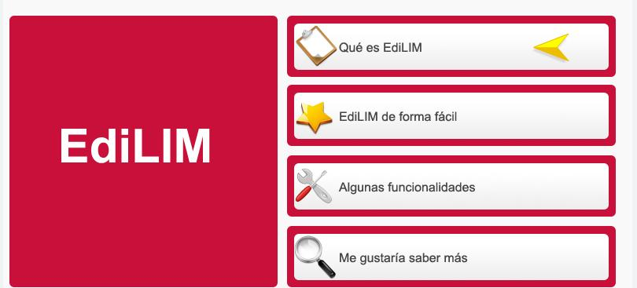

# 1.2 Edilim

[_**Lim**_](http://www.educalim.com/cinicio.htm) es una sencilla aplicación creada por **_F__rac Macias_**, un compañero de Galicia, que permite su libre uso y distribución siempre que se respete su gratuidad y autoría. Se trata de un entorno para la creación de **materiales educativos** muy fácil de utilizar que **no necesita** ninguna **instalación** en el ordenador y que crea materiales didácticos accesibles desde Internet, independientemente del equipo y del navegador utilizado.

Su **_editor de libros,_** [**_Edilim_**](http://www.educalim.com/cinicio.htm), es un **ejecutable de pequeño tamaño** que actualmente sólo se puede utilizar en Windows (también con Guadalinex si tienes instalado Wine). La mayor ventaja de esta herramienta es su sencillez y la posibilidad de crear una gran variedad de actividades (**hasta 42 diferentes** que se van ampliando con las nuevas versiones) reutilizando recursos que encontramos en la red (fotos, vídeos, animaciones, sonidos...). Los materiales elaborados se utilizan en línea por lo que son accesibles desde todos los equipos.

Ventajas:

*   No es necesario instalar nada en el ordenador.
*   Accesibilidad inmediata desde internet.
*   Independiente del sistema operativo, hardware y navegador web.
*   Tecnología Macromedia Flash, de contrastada fiabilidad y seguridad.
*   Entorno abierto, basado en el formato XML.

https://www.youtube.com/watch?v=tGkwP2jIrn8

### TUTORIAL

Edilim es una herramienta **muy interesante**, pero **menos intuitiva** que Educaplay o Thatquiz. Es por eso que os dejamos a vuestra disposición el siguiente [**manual interactivo**](http://www.aularagon.org/Files/UserFiles/File/Internet_aula/INF_COMUNICACION/Tutoriales/EdiLIM/EdiLIM.htm) que os ayudará en el proceso de creación de vuestros libros.

### PARA COMPARTIR EN EL BLOG.

Las actividades de Edilim **no se pueden embeber** como las de Educaplay, es decir no podemos verlas integradas dentro del entorno de nuestro blog a través de un código embebido. **Podemos compartir** **recursos externos**  a través del **enlace** que genera cada libro, **copiando la url** y pegándola en una entrada de nuestro blog vinculada a un texto o a una imagen. Sin embargo, **nuestras creaciones** propias deberán de pasar por **otro servidor** en la nube para poder ser compartidos en nuestros blogs. En el apartado **"ampliación de contenidos"** te explicamos como hacer todo el proceso.  

