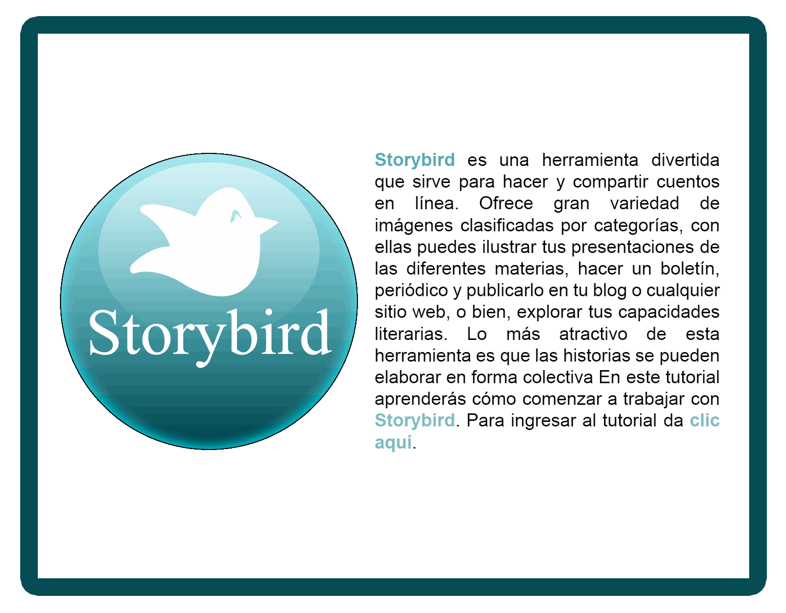

# 1.2 Tutoriales

### **TUTORIAL PRESENTACIÓN**

Sencillo manual creado con ISSUU por **Arturo Boga** en el que se presenta la herramienta y se muestra paso a paso todo el proceso desde el **registro** hasta la **publicación final** de la historia.

<iframe src="https://issuu.com/elboga1/docs/tutorial_para_crear_storybirds" frameborder="0" width="100%" height="700" allowfullscreen="true" mozallowfullscreen="true" webkitallowfullscreen="true"></iframe>

### TUTORIAL IMPRIMIBLE

[Tutorial](https://tutorialesedutic.wikispaces.com/file/view/TUTORIAL%20STORYBIRD.docx/342352462/TUTORIAL%20STORYBIRD.docx) en formato de Microsoft Word creado por **Shayla Palao Bosch.**

### VIDEOTUTORIAL

Video resumen de 7 minutos en el que se describen las opciones más interesantes de Storybird.

https://youtu.be/pg0fHgsPx4o