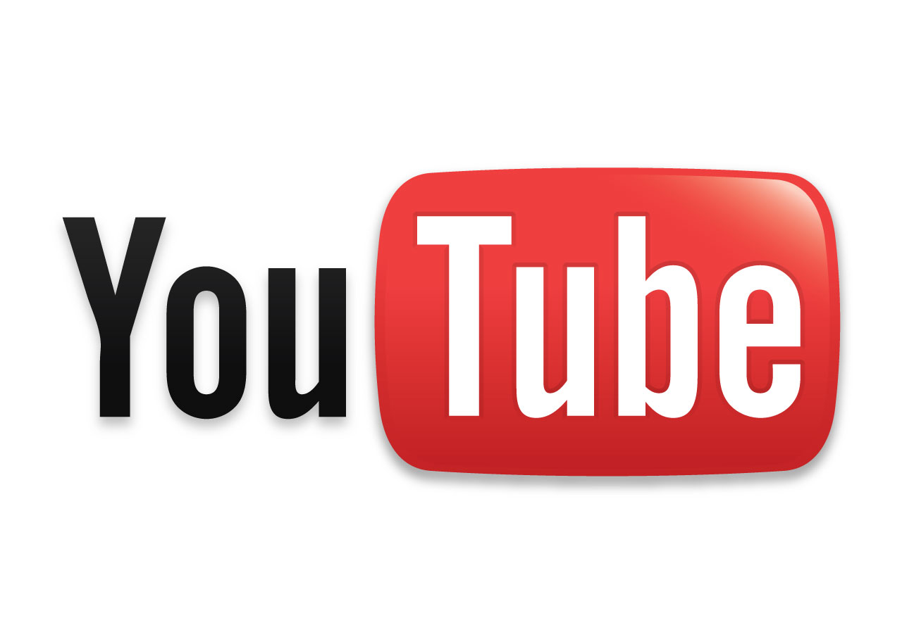
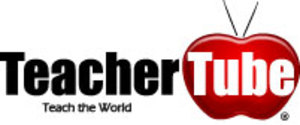
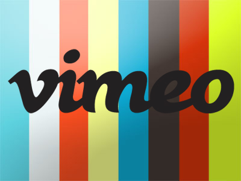

# 1.2. YouTube, TeacherTube y Vimeo

### YOUTUBE

Desde su nacimiento en **2005** [YouTube](http://www.youtube.com/) se ha hecho rápidamente popular. Más o menos todos tenemos una referencia de YouTube a través de los medios de comunicación, con su inagotable cantidad de **vídeos alojados,** incluso  se ha convertido en un recurso provechoso para programas de televisión, que utilizan de este modo escenas de uso libre para añadir contenido a sus sus emisiones.

Se trata de una web creada con la intención de **compartir videoclips**; podemos visualizarlos buscándolos por **categorías** o mediante **palabras clave**; el código de estos vídeos quedan expuestos para poder **volcarlos sobre un blog,** una página web, o referirlos desde un correo electrónico; asimismo cualquier individuo puede introducir en dicha página sus propios vídeos tras darse de alta, así como sustituirlos o eliminarlos si lo considera oportuno.Esa variedad de uso, además de la inmensa cantidad de clips alojados, permiten que podamos emplearlo también con un **sentido didáctico.**

Un dato relevante es el poder que estos medios van adquiriendo día a día, a punto tal, que nos enfrentamos a una realidad en la cual los docentes no podemos estar ajenos a las prácticas de nuestros/as alumnos/as; quienes de forma cotidiana se acercan a internet por distintos motivos, entre tantos, uno es el disfrutar de sus **"favoritos"** en [Youtube](http://www.youtube.com)

### TEACHERTUBE

Los **profesores** también pueden encontrar excelentes herramientas más concretas y enfocadas a la docencia que les faciliten su trabajo. Una de esas herramientas es **[TeacherTube](http://www.teachertube.com/). Teachertube nació en 2007** con la idea de establece una **comunidad en linea para compartir videos educativos.**

[TeacherTube](http://www.teachertube.com/) es un servicio, que al igual que Youtube, permite alojar videos pero con la particularidad de que estos se encuentran centrados exclusivamente en el ámbito **educacional**. Sin duda una herramienta muy valiosa tanto para **educadores** como para **estudiantes** y que además cuenta con una navegación fácil ya que tiene un diseño ordenado y amigable.

 Pero no solo videos podemos encontrar en **TeacherTube**, pues tiene otras funciones. Podemos encontrar, subir y descargar documentos, archivos de audio y fotografías. También tiene una sección de **biblioteca online** con lecciones, organizador de gráficos, envío de newsletters y libros que pueden imprimir los alumnos.

### VIMEO  

[**Vimeo**](https://vimeo.com/) fue lanzada en el **año 2004** como sitio web de a**lmacenaje compartido** de **videos**.Es un recurso que no estan conocido  como YouTube, o TeacherTube, pero Vimeo es muy **similar** a estas comunidades online. Da  la posibilidad de compartir archivos multimedia a personas de cualquier parte del mundo que tengan una conexión a Internet y un odenador.  

Al contrario de YouTube, donde subes un video y se convierte automáticamente en un reproductor flash con una calidad más baja, Vimeo logra compartir estos videos en **alta definición** y por eso se está haciendo famoso en el mundo. Es perfecto para las personas que están empezando a realizar documentales, cortos o cosas similares y tienen la necesidad de compartirlo desde el comienzo de sus andadas.

En el apartado anterior has podido ver ejemplos de YouTube y TeacherTube. Aquí te mostramos un ejemplo de video en la plataforma Vimeo, para que veas las **diferencias** de la plataforma en comparación con las otras dos.

<iframe src="https://player.vimeo.com/video/18013450" width="640" height="362" frameborder="0" allowfullscreen></iframe>
