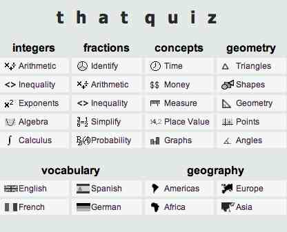

# 1.3 Thatquiz

ThatQuiz es un sitio web **gratuito** para **generar actividades, pruebas o ejercicios interactivos,** pero también puede ser un **aula virtual con herramientas de seguimiento y registro** de la evolución de los alumnos.

Es un **proyecto creado por Andrey Lyczack** que se inició en la República Dominicana que está disponible en varios idiomas: **inglés, español, francés, catalán, polaco, esloveno, chino y hebreo.**

La **licencia de ThatQuiz explica sus intenciones:** “Lo que ofrecemos: Software limpio y educativo para escuelas en cualquier país del mundo aunque sean ricas o pobres, sobresalientes o marginalizadas. Esperamos que aprovechen todos de la práctica aquí disponible. Este servicio es gratis para el uso educativo. Copyright © 2004-2008 Andrew Lyczak.”

Aunque su diseño aparenta estar más orientado hacia las **Matemáticas**, desde ThatQuiz se pueden diseñar actividades de **todas las áreas** y materias, Biología, Lengua, Lengua Extranjera…

Cualquier estudiante o profesor **sin necesidad de registrarse puede consultar** y practicar los ejercicios disponibles en la página principal.

Un profesor puede **utilizar libremente las pruebas** que han hecho otros profesores consultando el **Directorio de exámenes públicos**, o registrarse y realizar sus propios ejercicios autoevaluables, e incluso crear una clase.

El servicio más completo y útil que ofrece ThatQuiz para un **profesor registrado** es el de **crear su propia aula,** con registro de alumnos, asignación de tareas, seguimiento de resultados, y una serie de variables, limite de tiempo, modificar la respuesta, mostrar resultados acertados,… aplicables a las pruebas que permitirán al profesor configurar y flexibilizar sus pruebas según lo que quiera realizar en ese momento, un control o una evaluación más exhaustiva.

ThatQuiz permite **descargar el programa** para trabajar en local, esta versión es un poco más limitada, se reduce a los ejercicios de Matemáticas y no están disponibles las clases, ni el registro de notas de los alumnos.

### VIDEO TUTORIALES

Este videotutorial muestra los primeros pasos para comenzar a utilizar thaquiz. El primer paso es **crear la clase**:

https://youtu.be/kbm_XFYzolg

En este segundo video tutorial de explica como **crear los ejercicios** o evaluaciones:

https://youtu.be/gQiCKXUCfwc

### PARA COMPARTIR EN EL BLOG.

Las actividades Thatquiz **no permiten** la edición de un **código embebido** para insertarlo en nuestro blog. Así pues **la forma de conectar** nuestra actividad con el blog será simplemente añadiendo el **enlace a la URL** de nuestra actividad (la dirección web que aparece en nuestro navegador). Podemos camuflar  el enlace tras una imagen de captura de pantalla de la actividad.

