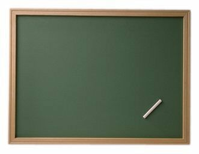

# 2.1 Aplicación en el aula de lengua extranjera

### APLICACIÓN DIDÁCTICA

Tal como hemos señalado en la introducción, Glogster es una **herramienta web 2.0** que nos permite la creación de **murales** digitales en los que podemos incluir:

*   Textos.
*   Imágenes.
*   Sonidos.
*   Vídeos.
*   Hipervínculos.

Tanto las imágenes, como los vídeos y los sonidos pueden ser **subidos desde nuestro ordenador** o ser insertados desde **otras páginas** web a través de **códigos embebidos** o direcciones **URL** (tal y como hacemos en nuestro blog). Además, los sonidos y los vídeos pueden ser grabados directamente desde Glogster.

 Hay tantas aplicacines de Glogster como profesores dispuetos a usarla. Pero por sus **características específicas** los usos más recomendados dentro del aula de lenguas extranjeras son los siguientes:

*   Presentación de **contenidos** incluyendo **audios y videos** relacionados.
*   Creación de **secuencias didácticas.**
*   Presentación de **proyectos de investigación** por parte de lo **alumnos.**
*   Presentación de **conocimientos previos** de cara a afrontar un nuevo tema.
*   **Resumen** de los contenidos aprendidos.
*   Producto final de una **webquest.**
*   Realización de **trabajos creativos** por parte de los alumnos.
*   Repositorio de **videos, audios**, relacionados con un topic.

###  ALGUNOS EJEMPLOS

En este apartado te vamos a mostrar algunos ejemplo prácticos de Glogter de otros **profesores de lenguas**. Al igual que otras herramientas que te hemos ido presentando a lo largo del curso, Glogster tiene su **zona** dedicada a **profesores** llamada **[Glogpedia](http://edu.glogster.com/glogpedia/),** donde puedes buscar por asignatura Glosters de otros usuarios docentes. A continuación  te dejamos unos cuantos ejemplos de diferentes aplicaciones, y te recomendamos que te pases por la [Glospedia](lamada%20Glogpedia,%20donde%20puedes%20buscar%20por%20asignatura%20glosters%20de%20otros%20usuarios%20docentes) para ver más usos de esta herrmienta.

1.- El primer ejemplo nos muestra un glogster especialmente ideado para **mostrar el contenido** de las horas en ingles. Incluye varios elementos, como **videos, imagenes y texto**. A nivel técnico es muy completo por que usa la mayoria de los accesorios que podemos incluir. A nivel pedagógico es un **material expositivo** creado por el docente con un final didáctico muy completo.

<iframe src="https://edu.glogster.com//glog/39012325" width="480" height="650" frameborder="0" scrolling="no" marginheight="0" marginwidth="0" style="overflow: hidden;"></iframe>

 2.- En este segundo ejemplo vemos un uso bastante similar al que hemos visto en el primero, es decir, un Glogster creado por el docente con **un objetivo pedagógico** claro. En este caso los sustantivos y adjetivos en Alemán.Vemos que a nivel de componentes es más pobre que el anterior, pero atención, **no se trata** **de insertar cualquier objeto** para que quede mejor visualmente, hay que intentar que los contenidos sean **atractivos, pero también significativos.**

<iframe src="https://edu.glogster.com//glog/37217343" width="650" height="480" frameborder="0" scrolling="no" marginheight="0" marginwidth="0" style="overflow: hidden;"></iframe>

3.- Para introducir **unidades didácticas**. Es una buena forma de presentar en un sólo Gloster los contenidos más destacados de una unidad didáctica concreta. No sólo será un **buen recurso** para la **presentación**, si no también de **revisión de contenidos** al final de la misma, tanto para el docente como para los alumnos.

<iframe src="https://edu.glogster.com//glog/32605625" width="480" height="650" frameborder="0" scrolling="no" marginheight="0" marginwidth="0" style="overflow: hidden;"></iframe>

4.- Este es un ejemplo de lo que podría ser un Glogster **creado por un alumno o un grupo de alumnos** en torno a un topic o tema. En este caso "The Beatles" es el tema central. Este tipo de trabajos para los alumnos, es idoneo por que necesita por una parte un trabajo de **investigación, recopilación, redacción, edición y presentación**. Es muy apropiado para alumnos del último ciclo de Educación Primaria y Educación Secundaria y Bachillerato.

<iframe src="https://edu.glogster.com//glog/35643794" width="480" height="650" frameborder="0" scrolling="no" marginheight="0" marginwidth="0" style="overflow: hidden;"></iframe>

5.- Este Glogster nos ha parecido muy interesante debido a su originalidad, y el buen planteamineto y desarrollo del mismo. A través de canciones, la autora **introduce** los **sonidos** del idioma. Muy interesante como recurso tanto por su **contenido** como por su **continente.**

<iframe src="https://edu.glogster.com//glog/29700039" width="480" height="650" frameborder="0" scrolling="no" marginheight="0" marginwidth="0" style="overflow: hidden;"></iframe>

En este otro ejemplo, simplemente introduce el **texto** de una canción y se incorpora el **audio** grabado por la propia profesora de la asigntatura. Gloster es una buena herramienta para crear **composiciones sencillas** en las que **insertar multimedias** como en este caso.

<iframe src="https://edu.glogster.com//glog/21083417" width="480" height="650" frameborder="0" scrolling="no" marginheight="0" marginwidth="0" style="overflow: hidden;"></iframe>