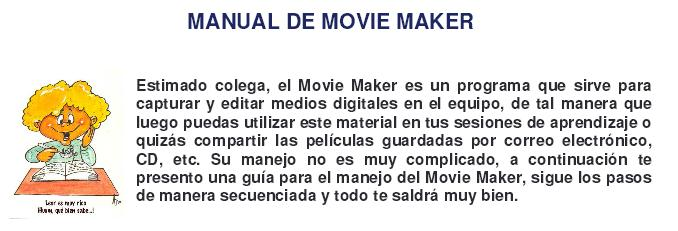

# 2.1. Movie Maker

 

[Windows Movie Maker](http://www.windows-movie-maker.org/es/) es un programa de **edición** de material **audiovisual**. Está incluido en  el sistema operativo de _Windows_.

La edición de material audiovisual consiste en **ordenar** diversos clips, de **audio, foto o video**, de acuerdo a un guión o idea previa, para lograr un vídeo más completo. Además, sus herramientas permiten agregar valores audiovisuales como títulos o efectos a las imágenes.

Dada la importancia de los medios audiovisuales en nuestra **Era de la imagen**, el uso de este programa repercute, sin duda, en la realización personal, ya que permite que los simples clips de vídeo recogidos con la cámara de video o de fotos, ser editados, dándoles así un carácter cercano a los materiales profesionales que se ven por televisión o Internet.

### CARATERÍSTICAS GENERALES

Algunas de las ventajas que te aportará _Windows Movie Maker_ son:

*   Es muy **fácil** de usar. Sistema muy visual y práctico de arrastrar y soltar.
*   Mejora notablemente la **calidad** de los clips de vídeo.
*   Aumenta la **variedad** de formatos de presentación.
*   **Combina** diversos trabajos y fuentes de información.
*   Aumenta la **motivación** en el proyecto.
*   Amplía la **variedad de recursos** para aplicar al material capturado.
*   Su uso implica un **aprendizaje** de las nociones básicas de los conceptos aplicados a **multimedia**.
*   Combinado con **dramatización** en el aula, es posible generar proyectos cooperativos estimulantes para los alumnos y fáciles de implementar que **potencian el aprendizaje de contenidos de Literatura**.

A nivel técnico es muy sencillo de utilizar.Las c**aracterísticas de edición** que incluye son.

*   **Efectos de vídeo**. Nos permiten modificar las imágenes capturadas.
*   **Transiciones de vídeo**. Enlazan de manera creativa las distintas secuencias.
*   **Creación de títulos y/o créditos**. Nos permiten incluir breves textos entre las imágenes.

### INSTALACIÓN Y TUTORIALES  

**1.- Descarga**

[Aquí](http://www.windows-movie-maker.org/es/) puedes descargar la **versión 2,6** del programa. La versión está completa y es en español.

**2.- Tutorial**

[1.- Tutorial](http://toolteca.files.wordpress.com/2011/03/manual_movie_maker.pdf) escrito por **Maria Hacho** en el que además de explicar la parte técnica, explica todo **el proceso** de trabajo desde el principio, con lo requisitos previos, y capturas de pantalla de cada uno de los pasos.

** 3.- Video tutorial**

https://youtu.be/G8YNY-Fg4-o
