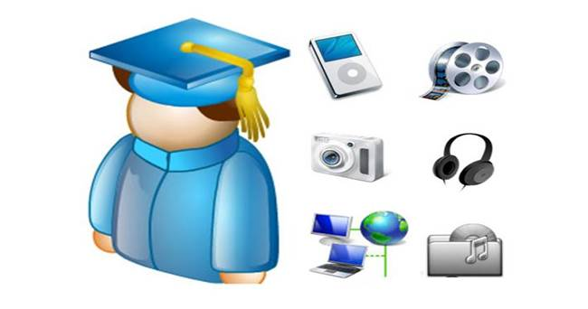
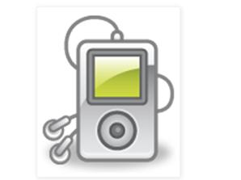
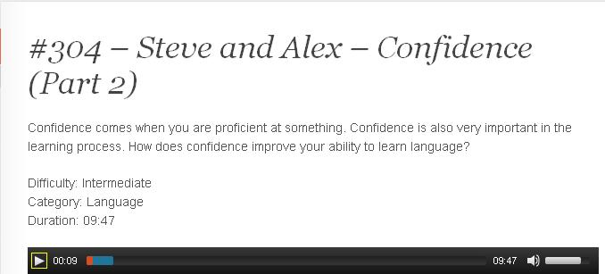
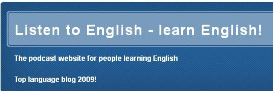
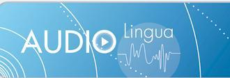

# 2.1 Recursos

### TIPOS DE POD CAST

Podemos encontrar muchos recursos podcat relacionados con el aprendizaje de lenguas extranjeras. los **recursos** creados **por terceros** en formato **podcast** son comparables a los que podemos conseguir en forma de libros, revistas, programas de radio o televisión, aunque normalmente mucho más fáciles y cómodos de obtener y gestionar. Los podemos encontrar en **diferentes formatos:**

**\- Programas de radio:** orientados a la enseñanza del idioma. En este caso [**Vaugham radio**](http://www.vaughanradio.com/reproductor) es un ejemplo del uso de este recurso como distribuidor de programas de radio y televisión **enfocados** al **aprendizaje del ingles.**

**\- Cuentos e historias:** Enfocados especialmente para las etapas de **infantil y primaria**. En estos casos suelen ser cortos, con un nivel de vocavulario y expresiones **muy adaptados**,  y con actividades didácticas incluidas.

**\- Entrevistas:** Otro recurso muy utilzado es la **conversación** entre dos personas en forma de  entrevista. En este caso los pod cast están más enfocados para los alumnos de **ESO y Bachhillerato**, puesto que el nivel de complejidad es superior.

**\- Graduados:** Tal es la especilización de algunos de estos portales, que en muchos de ellos podemos encontar diferentes **géneros** como los que se han nombrado, y **graduados** por niveles o por contenidos. Estos portales facilitan mucho la labor del docente puesto que la búsqueda de estos recursos no es siempre fácil.

**\- Hechos por alumnos:** En este apartado profundizaremos más en la **Unidad 3**, pero hay que tener en cuenta que a parte de crear nuestros propios recursos con nuestros alumnos, tambien esta muy bien que visitemos otros blogs en los que otros alumnos sean los protagonisras de las audiciones.

### EJEMPLOS DE PODCAST PARA EL AULA DE LENGUAS  

A continuación te vamos a facilitar algunos ejemplos de páginas que hemos considerado **muy interesantes** en las que encontarrás recursos podcast para trabajar con tus alumnos.

**1.- ["El blog para aprender ingles"](http://menuaingles.blogspot.com.es/2011/11/audios-indice.html):** Este blog propone una serie de podcast **graduados y categorizados** por **titulo** y **dificultad**. Los audios son muy **adaptables** tanto a Educación **Primaria** como a Educación **Secundaria**, y además están leidos con un ritmo, tono y velocidad que los hacen muy asequibles a los niveles educativos en los que trabajamos. No incluye aplicaciones didacticas, pero lo destacamos por el gran número de audios disponibles y por su perfecta organización.

[** 2.-English Ling**](http://englishlingq.com/): Este blog incluye listenings más orientados a  **Educación Secundaria**. La duración media de los audios es de 8 minutos, y en la mayoria de los casos son **conversaciones** entre 2 o más personas sobre topics muy concretos. No presente aplicación didáctica pero sí que encontramos la **transcripción del texto.**Además de escuchar online, **permite descargar** los audios en mp3.

[**3.- ESL:**](http://www.eslpod.com/website/index_new.html#) English as second language es un **portal de subscripción** que presenta podcast interesantes y que muestra los podcast de forma gratuita pero necesita de **resgistro de pago** par acceder a las **aplicaciones didácticas.**

[**4.-The mansion English:**](http://www.mansioningles.com/listening00.htm) Ejercicios de listening en  inglés graduados por nivel de dificultad y con ejercicios didácticos relacionados. Incluye un gran repositorio en el que encontramos diferentes topics y especifica el tipo de acento (British or American) en cada ejercicio. Especialmente inidicado para primaria y secundaria.

[** 5.-123 listening English.**](http://www.123listening.com/) Página de podcasting que ofrece varios **ejercicios didácticos** apoyados por **pod cast**.Idonea para Educación Primaria.

**6.-[Francaisfacile](http://www.podcastfrancaisfacile.com/englishmenu/french-communication-dialogue-daily-life-listen-to-mp3.html)** Es un portal en el que encontramos muchos recursos para trabajar la **lengua francesa** en el aula. Los podcast que ofrece además de estar **ordenados** por dificultad, se ciñen a **situaciones comunicativas** comunes, y además vienen acompañados de una **propuesta didáctica.**

[**7.- Listen to English.**](http://www.listen-to-english.com/index.php) Esta página ha recibido varios **premios** relacionados con la enseñanza de **lenguas extranjeras**. En un formato sencillo, propone diferentes podcast idoneos para la enseñanza en **ESO y Bachillerato, o en inglés con adultos**. Además ofrece la posibilidad de **embeber los podcast** en blogs, y ofrece los **textos** en formato **pdf.**

[**8.- Lyricsgaps:**](http://es.lyricsgaps.com/exercises/filter/language/fr/) Una pagina de podcast **musicales** en **diferentes lenguas**, en las que propone ejercicios por cada una de las canciones. Los ejercicios son de **rellenar huecos,** y ofrece la opción de cantar en formato de **karaoke**. En este ejemplo vemos canciones para la **lengua francesa.**

**[9.- Ielanguages:](http://ielanguages.com/frenchlistening.html)** Página que ofrece **videocas**t de francés relacionados con situaciones comunicativas conectadas con situaciones reales. Ofrece los **textos** de los videos en formato **txt.**

[**10.- Audiolingua:**](http://www.audio-lingua.eu/spip.php?rubrique3&lang=fr) Este portal destaca por que es uno de los pocos que trabaja de una **forma global** el aprendizaje de lenguas. Desde el **ingles, francés, chino, portugués,  alemán, o ruso,** oferce diferentes podcast muy bien **categorizados,** por **lengua, dificultad y duración.** En este **ejemplo** hemos seleccionado la subcategoría de **alemán**, pero desde esa misma página se puede acceder al resto de idiomas.

