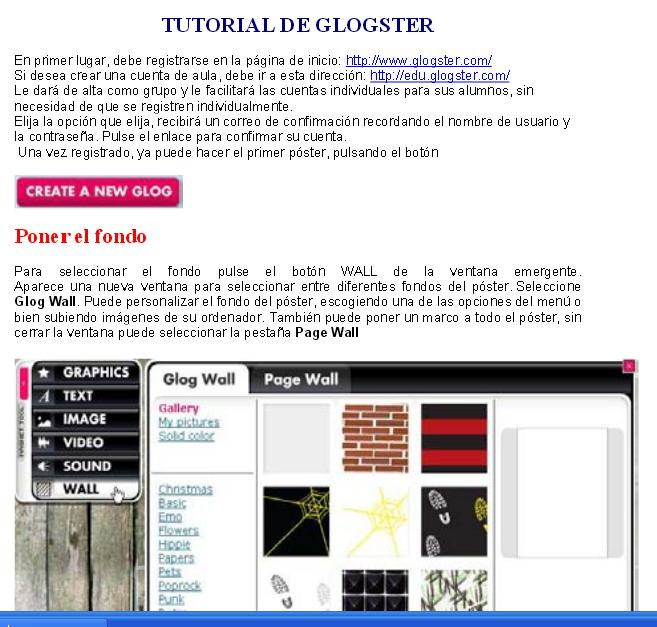

# 2.2 Tutoriales

### TUTORIAL PRESENTACIÓN SLIDESHARE.

El **CEDEC** (Centro Nacional de desarrollo curricular)  tiene un estupendo **[manual de Glogster](http://cedec.ite.educacion.es/es/aplicaciones-en-la-web/821-crea-y-publica-un-poster-multimedia-en-glogster)** con algunos ejemplos.

<iframe src="//www.slideshare.net/slideshow/embed_code/key/6OzK9lu3c16FLE" width="595" height="485" frameborder="0" marginwidth="0" marginheight="0" scrolling="no" style="border:1px solid #CCC; border-width:1px; margin-bottom:5px; max-width: 100%;" allowfullscreen> </iframe> 
 <strong> <a href="//www.slideshare.net/cedecite/glogster-10511354" title="Glogster. CeDeC" target="_blank">Glogster. CeDeC</a> </strong> from <strong><a href="https://www.slideshare.net/cedecite" target="_blank">CEDEC</a></strong> 

### TUTORIAL IMPRIMIBLE.

Si lo prefieres en PDF, para descargar, puedes utilizar este **[manual](http://blog.educastur.es/sapiens/files/2010/04/tutorialglogster_es2.pdf) **creado por Lourdes Doménech en Educastur. Tal y como te hemos dicho en la unidad, es **preferible** que utilices la **versión estandar** a la versión para educación, ya que esta segunda es de pago.

### VIDEOTUTORIAL.

Videotutorial en el que se presenta la herramienta y se decriben las utilidades básicas para diseñar glogs.

https://youtu.be/_TSNAuwWzq8
