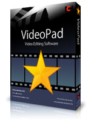

# 2.2. Video Pad

[**VideoPad Video Editor**](http://www.nchsoftware.com/videopad/es/index.html) es un  programa de **edición** y muy recomendado para todos aquellos aficionados o profesionales de los medios audiovisuales que deseen editar un video con **fotografías, música, efectos** o simplemente montar varios videos para dejar uno solo.

**VideoPad Video Editor** cuenta con una gran lista de opciones para llevar a cabo, entre las más comunes y que seguramente más te llamarán la atención se encuentra la opción de cargar música (tu canción favorita) y ponerla como pista de fondo para tu video o para tu secuencia de fotografías. De igual forma, juntar las fotografías para formar un video es otro sistema para crear el video con tu sello personal.

La interfaz que ofrece **VideoPad Video Editor** viene con un diseño bastante sofisticado, el cual no te complicará nada a la hora de ejecutarlo debido a que sus opciones son visibles y entendibles. Consta de un tablero en el cual tendrás que ubicar lo que deseas reproducir, otro tablero en donde se puede visualizar el proceso del video y un panel donde se ubican los archivos que se desean agregar a la edición.

La instalación de **VideoPad Video Editor** es bastante simple de forma procedimental y una vez lo tengas instalado en tu ordenador solo basta con ejecutarlo para comenzar a crear tus videos de una forma bastante dinámica pero a la misma vez, con cierto grado de profesionalismo.

**VideoPad Video Editor** cuenta con una gran lista de opciones para llevar a cabo, entre las más comunes y que seguramente más te llamarán la atención se encuentra la opción de cargar música (tu canción favorita) y ponerla como pista de fondo para tu video o para tu secuencia de fotografías. De igual forma, juntar las fotografías para formar un video es otro sistema para crear el video con tu sello personal.

La interfaz que ofrece **VideoPad Video Editor** viene con un diseño bastante intuitivo, el cual no te complicará nada a la hora de ejecutarlo debido a que sus opciones son visibles y entendibles. Consta de un tablero en el cual tendrás que ubicar lo que deseas reproducir, otro tablero en donde se puede visualizar el proceso del video y un panel donde se ubican los archivos que se desean agregar a la edición.

### INSTALACIÓN Y TUTORIALES

**1.- Descarga:**

 Video Pad tiene una versión de uso profesional , y otra de uso doméstico **completamente gratuita**. Además permite la instalación tanto en **Windows** como en **Mac**.En el siguiente enlace puedes acceder a las dos:

[http://www.nchsoftware.com/videopad/es/index.html](http://www.nchsoftware.com/videopad/es/index.html)

**2.- Tutorial**

[Tutorial en pdf.](http://vviana.es/doc/Manual%20de%20edicion%20video_Video%20Pad.pdf)

   
 **3.- Video tutorial**

https://youtu.be/ylq9gyO8xA4
 

