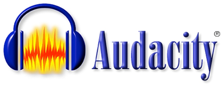
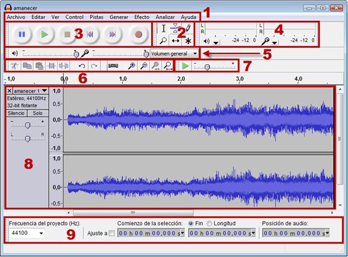
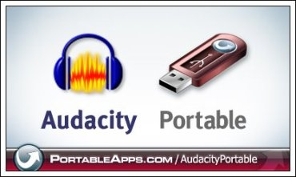
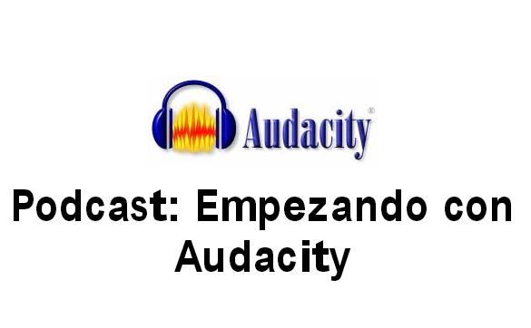

# 3.1 Audacity

Fig 2.17  [manual.audacityteam.org](http://www.google.es/url?sa=i&rct=j&q=&esrc=s&source=images&cd=&cad=rja&docid=PxgdHHRj85Kk9M&tbnid=SQ-6NP_T-0n2oM:&ved=0CAQQjB0&url=http%3A%2F%2Fmanual.audacityteam.org%2Fman%2FMain_Page%2Fes&ei=43CEUqqfJoTCswbwo4HwBQ&bvm=bv.56343320,d.Yms&psig=AFQjCNGt8Lf_U47W40hAnx6RW_xdri7_VQ&ust=1384497750886777) Licencia Creative Commons

**Audacity** es un **grabador** y  **editor** de sonido, fácil de usar y que nos da muchas posibilidades. La diferencia de Audacity con el recurso anterior, la grabadora de sonidos, es que mientras la grabadora no nos deja editar el resultado final,  con este programa se van a poder , **convertir archivos** de audio a diferentes formatos, cortar, pegar o empalmar pistas de audio para mezclar sonidos, cambiar la velocidad de grabación o reproducción, agregar efectos de sonido, etc. Resumiendo, lograrás resultados **más profesionale**s y más **motivadores** para tus alumnos.

### CARACTERÍSTICAS TÉCNICAS:

*   Grabación de audio en **tiempo real.**
*   **Edición** de archivos de audio tipo Ogg Vorbis, MP3, WAV, AIFF, AU, LOF, WMP.
*   **Importación** de archivos de formato MIDI,RAW y MP3.
*   Edición de **pistas múltiples.**
*   Posibilidad de agregar **efectos** al sonido (eco, inversión, tono, etc).
*   Posibilidad de usar **plug-ins** para aumentar su funcionalidad.
*   Mejora de efectos, en especial **ecualización**, **eliminación de ruido** y normalización.  
    
*   **Recuperación** automática tras bloqueo en el caso de terminación anormal del programa.

### PRIMEROS PASOS  

Como verás,  en el apartado "para saber más", hemos incluido un manual completo del programa pero en este apartado pretendemos explicarte de una forma sencilla, lo básico para que puedas realizar tu primera grabación con el programa.

1.- Instalación:Audacity es un programa libre. Su instalación es gratuita y la podemos hacer directamente desde su página oficial. Otra de las ventajas de este sotfware es que vas a encontrar versiones para los diferentes sistemas operativos, Windows, Linux, Mac, etc.

[http://audacity.sourceforge.net/](http://audacity.sourceforge.net/)

**2.- Entorno del programa:** Una vez instalado el programa, accederás al entorno de trabajo. Como hemos dicho anteriormente es un entorno muy sencillo que presenta iconos y menús muy intuitivos. En la siguiente figura te detallamos los elementos indispensables para comenzar a grabar.

           Fig 2.18 [http://www.ite.educacion.es](http://www.ite.educacion.es) Licencia Creative Commons

1.- **Barra de menús.** Como en cualquier aplicación Windows se puede utilizar para activar cualquier opción del programa.

2.- **Barra de herramientas.** Contiene algunas de las operaciones de uso más frecuente:

3.- **Barra de control de reproducción**. Presenta los botones de grabación y reproducción.

4.- **Barra de medidores de Nivel de Entrada y salida**.

5.- **Barra de Mezclador.** Controla los niveles de salida y entrada de sonido.

6.- **Barra de Transcripción.** Permite iniciar la reproducción del audio y definir mediante el deslizador la velocidad a la que se reproducirá el audio

7.- **Barra de Edición.**

8.- **Pista de audio.**

9.- **Barra de Selección**

### VERSIÓN PORTABLE.  

Cada vez son más **frecuentes** las versiones **"portable"** de software. Estas versiones permiten llevar el programa instalado **en memorias externas** de manera que podremos siempre hacer uso de él aunque en el ordenador que estamos utilizando no esté instalado el programa. Esta funcionalidad es muy interesante respecto a nuestro trabajo como docentes, puesto que no dependeremos del ordenador del aula, si no que con conectar el **usb**, tendremos el programa a nuestra disposición.

En este [enlace](http://audacity-portable.softonic.com/) podras descargarte la versión **portable de Audacity** que nos ofrece las mismas características que su versión instalable.

                   Fig 2.19 portable apps . Licencia Creative Commons

### VIDEOTUTORIAL.  

El siguiente video muestra el **uso básico** de Audacity al nivel en el que lo vas a utilizar en el desarrollo de la tarea correspondiente a este módulo. Por supuesto que el programa tiene muchas más posibilidades de edición, pero este tutorial te ayudará a crear tus **primeros episodios** de podcast de forma simple.

###  TUTORIAL

Todo lo que te hemos presentado hasta ahora en esta unidad respecto a Audacity, es lo básico para comenzar ha hacer tus primeras grabaciones, que es exactamente lo que necesitas para realizar la tarea de este módulo. Sin embargo el programa tiene muchas más **aplicaciones y posibilidades de edición** que te pueden ser muy útiles.

Este [manual](Tutorial-Audacity.pdf) creado por Daniel Primo Gorgoso, describe de una forma **más específica** característica técnicas concretas del programa muy interesantes tanto para la grabación como la posterior **edición de pistas.**

Fig 2.21 Manual Audaciy

