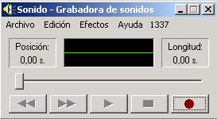

# 3.2 Grabadora de sonidos de Windows

Fig 2.22 [ut.gamersmafia.com](http://www.google.es/url?sa=i&rct=j&q=&esrc=s&source=images&cd=&cad=rja&docid=u4gW_oMZv6aQyM&tbnid=l55_fbN8Iil4tM:&ved=0CAQQjB0&url=http%3A%2F%2Fut.gamersmafia.com%2Ftutoriales%2Fshow%2F18&ei=tcGIUtCIBcvz0gWTjYDIAQ&bvm=bv.56643336,d.d2k&psig=AFQjCNHhn4nxb_fFPMs6kCakUchpG0ybPQ&ust=1384780548318874) Licencia Creative Commons

La Grabadora de sonidos de Windows es la herramienta **más sencilla** de grabación de sonidos. Viene instalada **por defecto** en los equipos con las diferentes versiones del sistema operativo de **Windows.**

Podemos usar la grabadora de sonidos para **grabar** un sonido y **guardarlo** en el equipo como un archivo de audio. Tenemos la posibilidad de  grabar sonidos de **diferentes dispositivos** de audio, como un micrófono conectado a la tarjeta de sonido de su equipo. Los tipos de orígenes de entrada de audio de los que puede grabar dependen de los dispositivos de audio de los que disponga, así como de los **orígenes de entrada** de la tarjeta de sonido.

###  PASOS PARA LA GRABACIÓN.

*   Tener un **dispositivo de entrada** de audio conectado al equipo como, por ejemplo, un micrófono.

*   Hacer  clic en el botón Inicio, **accesorios**, entretenimiento, grabadora de sonidos.

*   Clic en **Iniciar grabación.**

*   Para detener la grabación de audio,  clic en **Detener grabación.**

*   Para seguir grabando audio, haga clic en Cancelar en el cuadro de diálogo Guardar como y, después, haga clic en Reanudar grabación. Siga grabando el sonido y, a continuación, haga clic en Detener grabación.

*   Clic en el cuadro **Nombre de archivo**, escriba un nombre de archivo para el sonido grabado y, a continuación, haga clic en **Guardar** para guardar el sonido grabado en un archivo de audio.

### CONVERSIÓN DE FORMATO

El **problema** más habitual que hay al trabajar con la grabadora de sonidos es el **formato de audio** de los archivos que se generan. La grabadora de sonidos sólo crea archivos **.wav.** Los arhivos de audio con extensión .wav son archivos de audio digital normalmente **sin** **compresión** dedatos desarrollado y propiedad de Microsoft. 

A la hora de **compartir** estos archivos de audio, cualquier herramienta **2.0** que utilicemos, nos va a **solicitar** un archivo de audio **comprimido,** o lo que es lo mismo, un **archivo mp3, **por lo que habrá que convertir el archivo generado a un archivo comrpimido.

A continuación te ofrecemos un par de enlaces a **conversores** de formatos de **audio** que te permitirán hacer esta conversión de .wav a .mp3

**[1.- FREE WAV TO MP3 CONVERTER](http://free-wav-to-mp3-converter.softonic.com/)  
**

**[2.- MEDIA ONLINE CONVERTER](http://media.io/es/)**

