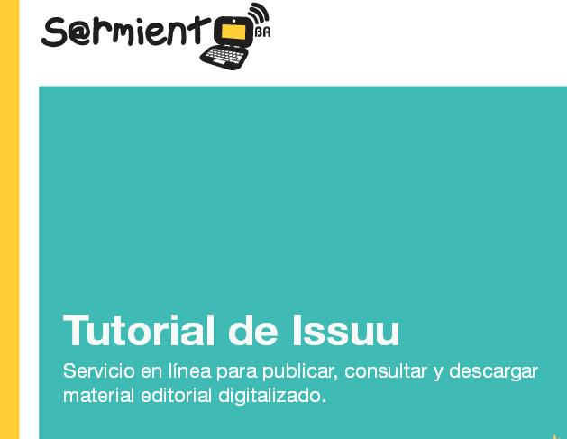

# 3.2 Tutoriales

Fig 4.13 [surpatterns.com](http://www.google.com/url?sa=i&rct=j&q=&esrc=s&source=images&cd=&cad=rja&docid=C0yOZKXJoZGAcM&tbnid=YyJChUR0eyIf8M:&ved=0CAQQjB0&url=http%3A%2F%2Fsurpatterns.com%2Fsitio%2Fsuscripcion-noticias%2F&ei=0LiTUp6eNOSo0QXusoHoCA&bvm=bv.56988011,d.d2k&psig=AFQjCNEMyMwwHMj4sAvZS1d6j0yVsXYMTw&ust=1385499099869192) Licencia Creative Commons

### TUTORIAL  PRESENTACIÓN

**Breve tutorial** de  **Jose Ramón Ollalla,** en el que presenta de forma sencilla la herramienta.

### TUTORIAL IMPRIMIBLE

**[Tutorial](http://integrar.bue.edu.ar/integrar/wp-content/uploads/2011/06/Tutorial-Issuu.pdf)  básico** de 18 páginas en formato pdf, **suficiente** para conseguir comenzar a trabajar con la herramienta.

### VIDEO TUTORIAL

Video resumen creado por  **Jose Maria Reyes** de las características primcipales de ISSUU así como de los **procedimientos de registro, creación y de compartir publicaciones.**

