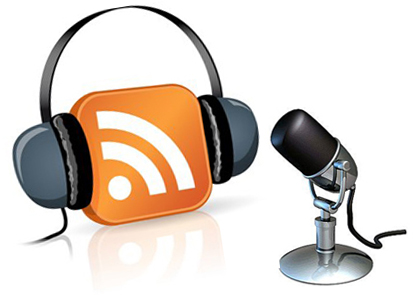
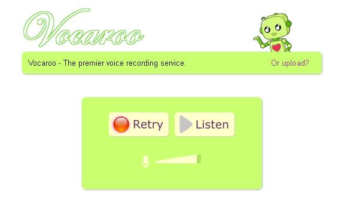
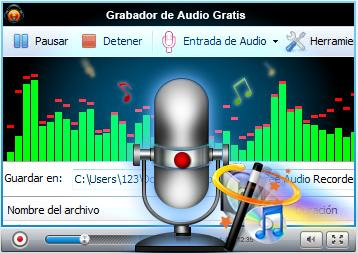

# 3.3 Grabadoras de audio online

Fig 2.23 [grupo-enterprise.blogspot.com](http://www.google.es/url?sa=i&rct=j&q=&esrc=s&source=images&cd=&cad=rja&docid=pKMojPRFtmvPAM&tbnid=LqjE1CPfhKtMCM:&ved=0CAQQjB0&url=http%3A%2F%2Fgrupo-enterprise.blogspot.com%2F&ei=78SIUpX4H6Ws0QW_n4GIDQ&bvm=bv.56643336,d.d2k&psig=AFQjCNFWrIfhlmejVbwQhWIerfx3ESSd6A&ust=1384781381436765) Licencia Creative Commons

**Hasta ahora** te hemos presentado dos herramientas para grabar audios que en definitiva son **programas instalados** en nuestro equipo: **Audacity** y la **grabadora de sonidos de Windows**. Las herramientas **web 2.0** han supuesto un **avance** en cuanto a la oferta de software online, ofreciendo **herramientas online** que **sustituyen** a software instalable.

En este apartado de la unidad 3 te queremos presentar **tres herramientas** muy interesantes que te facilitarán el proceso de grabación de tus pistas de audio ofreciendote varias **ventajas** respecto a la utilización de programas offline. La principal es la posiblidad de comenzar una grabación sin necesidad siquiera de confirmar que el ordenador en el que trabajas,  tiene instalado programas de grabación. Sólo tendrás que dirigirte a la **página de grabación**, y comenzar el proceso.

1.- [**ONLINE VOICE RECORDER: **](http://online-voice-recorder.com/es/) es una **sencilla** aplicación gratuita que permite grabar el sonido del micrófono. Además de **grabar,** puedes **cortar** el sonido y **guardarlo** en tu ordenador

Fig 2.24 Captura de pantalla propia

[**2.- VOCAROO:**](http://vocaroo.com/) Además de las mismas características de de la herramienta anterior, Vocaroo tiene la característica de que **genera** automáticamente un **código embebido** que te permite compartir en tu **blog** o web la grabación de una forma directa.

Fig  2.25 Captura de pantalla propia

[**3.- APOWER SOFT AUDIO RECORDER**:](http://www.apowersoft.es/grabador-de-audio-gratis) Una de las herramientas más utilizadas para grabar audios online por que suma a la posiblidad de **grabar** y **compartir** en cualquier espacio web 2,0, la posibilidad de **convertir archivo**s de audio en cualquier formato, lo cual la convierte en una de las herramientas online de audio con **más prestaciones.**

Fig 2.26 Captura de pantalla propia

