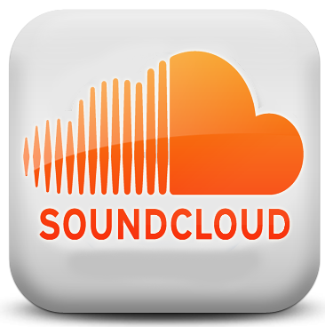

# 4.2 Sound Cloud

                                Fig 2.29 [www.techpuntocero.com](http://www.google.com/url?sa=i&rct=j&q=&esrc=s&source=images&cd=&cad=rja&docid=wIXS9NFvlqBUvM&tbnid=5nk5OdQOrquk5M:&ved=0CAQQjB0&url=http%3A%2F%2Fwww.techpuntocero.com%2Fsoundcloud-el-instagram-del-audio%2F&ei=tuiIUsmGNYSI0AW7sIGoBQ&bvm=bv.56643336,d.d2k&psig=AFQjCNGIPUa4AnZ-00mzYPu0Nlqt1zEwdg&ust=1384790578055070) Licencia Creative Commons

 **[SoundCloud](http://soundcloud.com/)** es otra  plataforma social que permite subir y compartir archivos de audio on-line.es especialmente conocida por aquellos usuarios que quieren promocionar y distribuir sus proyectos musicales.SoundCloud se está convirtiendo en **un potente canal de distribución de materiales de audio educativos** gracias a una serie de funcionalidades

SoundCloud está disponible para dispositivos **iOS y Android,** con lo que el alumno puede fácilmente grabar su voz desde su móvil en casa y subir el resultado tras la práctica.  

Como diferencia entre Sound Cloud y Poderato, destamos que Sound Cloud **sí que permite grabar** online desde la misma plataforma, característica que Poderato no tiene.

El siguiente **videotutorial** creado por Jhoana Mero, explica los pasos para subir y compartir un audio a Sound Cloud.

### PASO A PASO.

*    Hay que **registrarse** y crear un usuario y contraseña.
*    A partir de ese momento ya podemos o **grabar** un sonido o **subir** uno de nuestro equipo.
*    Seleccionamos **"choose a file"** y buscamos el sonido en nuestro equipo.

**IMPORTANTE**: En este momento tu audio ya forma parte de la **libreria de Sound Cloud**, y está localizado en tu espacio. Ahora se trata de poder **compartilo** en tu blog a partir de un código embebido.

*   Una vez subido el sonido vamos a "**go to your sounds"**
*   Accedemos a **nuestro audio**
*   Clicamos en **"share"** y compiamos el código embebido que insertaremos en la entrada del blog.

