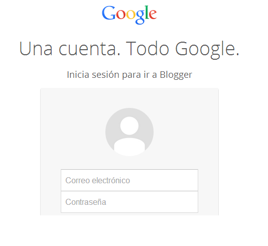
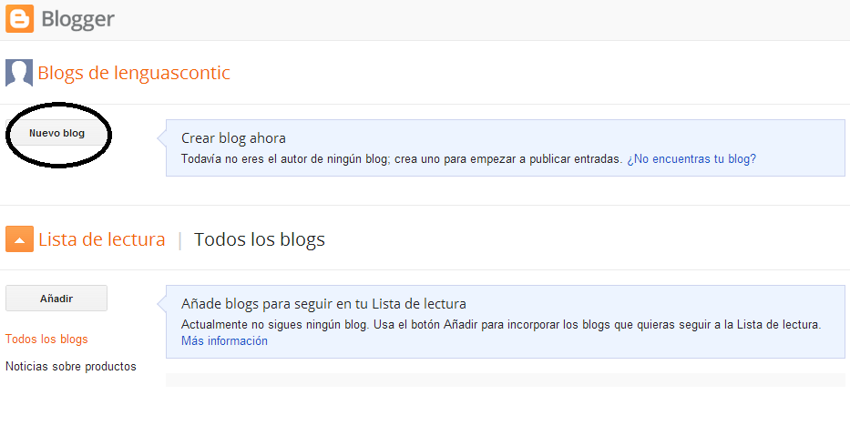
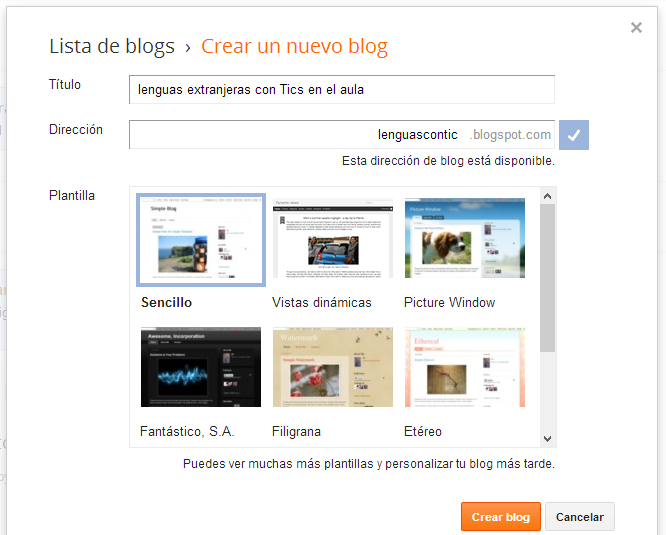
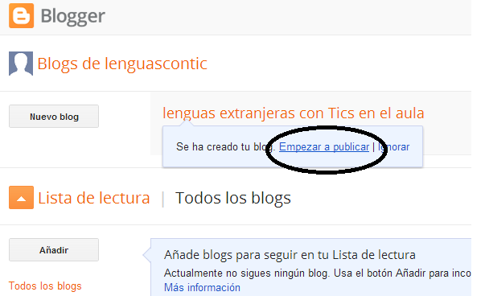
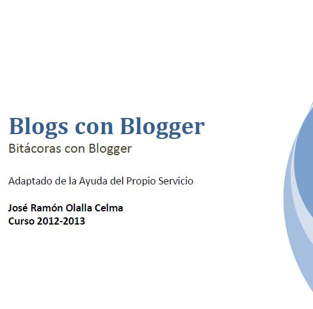

# Blogger

Blogger es una de las **primeras herramientas de publicación** de bitácora en línea. Fué  creado por Pyra Labs en 1999, y adquirido por Google en el año 2003. Fue pionero en hacer más sencillas y asequibles las publicaciones web.Para publicar contenidos, el usuario no tiene que escribir **ningún código** o instalar programas de servidor.

En lugar  de escribir a mano el código HTML y frecuentemente subir las nuevas publicaciones, el usuario puede publicar a su bitácora **en línea**, que se actualiza dinámicamente, llenando un formulario en el sitio web de Blogger. Esto puede ser realizado por cualquier navegador web actualizado y los resultados se reflejan inmediatamente.

### COMENZAR EN BLOGGER

¿Cómo comenzar a trabajar con blogger?

1.- Regístrate como usuario de gmail.

2.- Entra en [www.blogger.com](http://www.blogger.com)

3.- Seguimos las siguientes pantallas.

Para publicar un blog en blogger, es necesario estar **registrado en gmaill,** es decir, tener una cuenta  en ese servidor de correo electrónico. Desde esta misma página puedes registrarte si no la tienes, y si ya eres usuario sólo tienes que introducir tu id y contraseña. 

Una vez has entrado en el servicio, accedes a la página general de **gestión de tus blogs**. Si ya tienes blogs, aparecerán en un listado. Si no has creado ningún blog todavía, la pantalla aparecerá tal y como se muestra en la foto. Es el mometo de comenzar, pinchando en **"crear nuevo blog"**

En esta tercera pantalla decidimos tres características fundamentales de nuestro blog. 

**El título:** Es el nombre que aparecerá en la cabecera de tu blog y que dará **nombre general a tu blog**. Será también criterio de búsqueda en los motores de búsqueda.

**La dirección:** **Muy importante** puesto que será la puerta de acceso a tu blog. Te recomendamos que elijas un nombre **sencillo y fácil** de recordar puesto que eso facilitará su difusión. En este campo **no** se pueden incluir **caracteres especiales ni espacios.**

En este punto tu blog ya está creado y en la página de confirmación, te da la opcion de crear la **primera entrada.**

 Fig 1.34 captura de pantalla

Al final de estos pasos tu blog se habrá creado correctamente.

### TUTORIAL

En el siguiente enlace te facilitamos un **sencillo**  manual de usuario creado por **José Ramón Olalla** en el que encontrarás todo lo necesario para comenzar a publicar de una forma fácil.

[Manual de Blogs con Blogger. Jose Ramón Olalla](http://facilytic.catedu.es/wp-content/uploads/2013/10/blogger.pdf)

