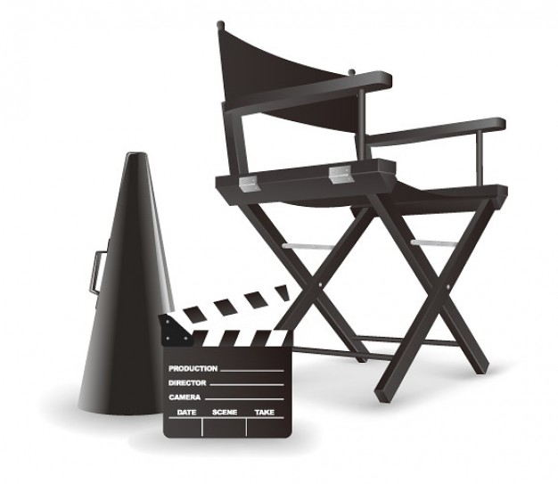

# M3.5 y acción!

Fig 3.1 [www.freepik.es](http://www.google.es/url?sa=i&rct=j&q=&esrc=s&source=images&cd=&cad=rja&docid=bahSrlpbcqcW-M&tbnid=JI7WOXOe-wR7LM:&ved=0CAQQjB0&url=http%3A%2F%2Fwww.freepik.es%2Fvector-gratis%2Fsilla-del-director-vector-de-material_510255.htm&ei=ZuOLUt2BB4Oe0QWshYGICg&bvm=bv.56643336,d.d2k&psig=AFQjCNGRdNW95QXGfosCCVahxovepApDsg&ust=1384985822619893) Licencia Creative Commons

El uso de **medios de comunicación** e información en las **prácticas pedagógicas** es un recurso indispensable para acercar el desarrollo de las competencias de los estudiantes a las dinámicas del mundo contemporáneo.

Estamos en una sociedad mediática donde nos encontramos con unas nuevas formas de comunicación y con un mayor número de mensajes. En ese sentido,  el **sistema educativo** debe orientarse hacia una **mejor comprensión** de estos **lenguajes** y hacia la **incorporación** de estos medios en el aula.

En este módulo nos vamos a interesar por el **lenguaje audivisual** en el aula de lenguas extranjeras.Un medio con el que nuestros alumnos están plenamente familiarizados y que tiene un factor de **motivación** que debemos utilizar.

Vamos a reflejar **diferentes** formas de enfocar el poder que tiene el mensaje audivisual en nuestros alumnos, para crear contenidos para ellos y con ellos, que nos ayuden a completar, ilustrar, o incluso desarrollar por completo unos determinados contenidos de nuestra asignatura. Siguiendo la línea del curso, vamos a orientar todo el contenido a **integrar** la producción audiovisual en tu blog de curso. Te vamos a presentar **herramientas** que te van a permitir crear materiales para posteriormente **compartirlos** a través de la web 2.0.

El objetivo de este modulo es convertiros en **autores** potenciales de sencillas piezas audivisuales, y que seais capaces de desarrollar estrategias de enseñanza y aprendizaje para involucrar a **vuestros alumnos** tanto de Primaria como de Secundaria en la creación de **materiales propios.**

El siguiente video es un ejemplo de material realizado por el alumnado para un proyecto de **Science.** Visto por primera vez parece que haya un gran trabajo detrás, pero realmente **es sencillo**, y como veréis el resultado merece la pena. 

### HERRAMIENTAS QUE VAMOS A UTILIZAR

Tal y como hemos hecho en el módulo anterior,  vamos a presentar **varias opciones** para poder editar el video. Hay que destacar que el objetivo prioritario es compartirlo en nuestro blog, con lo que volveremos a utilizar herramientas web 2.0.

Tal y como estamos haciendo a lo largo de este curso, te vamos a presentar **dos tipos de herramientas:**

*   Software instalable
*   Aplicaciones web 2.0

Y dentro de estas dos posiblidades técnicas, te oferceremos herramientas que te permitirán por una parte el uso de **recursos** ya **creados** por otros compañeros, y otras que te permitirán crear tus **propias producciones.**

En primer lugar  vamos a mostrarte **diferentes portales** de **videos compartidos** y sus características más significativas: **Youtube, TeacherTube y Vimeo.  
**

Te vamos a introducir a **dos programas** de edición que necesitan instalación y que son muy conocidos por su **facilidad de uso**. Los programas son **Windows Movie Maker** y **Video Pad.**

Por otra parte, y como **herramienta web 2, 0** te vamos a presentar **Animoto,** una herramienta con la que vamos a poder crear nuestras porducciones audividuales a través de una aplicación online y que nos permitirá compartir y editar en modalidad de trabajo compartido nuestras producciones audioovisuales.  

  

## Objetivos

*   Presentar la importancia y los usos de los materiales audiovisuales en el aula.
*   Proporcionar ejemplos reales  de aplicación didáctica en el aula de lenguas extranjeras.
*   Mostrar los principales servidores de videos: YouTube TeacherTube y Vimeo.
*   Familiarizar al profesorado con entornos de edición de imagen.
*   Establecer diferencias estre software o programas de edición de video, y herramentas web 2.0.
*   Dotar de herramientas para la realización de producciones audiovisuales: Movie Maker, Video Pad y Aminoto.
*   Enseñar a compartir las producciones audiovisuales a través de herramientas web 2.0.

