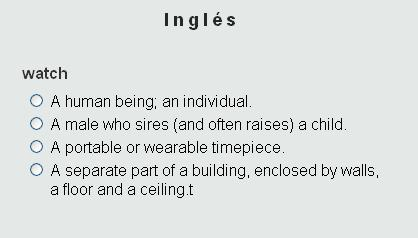

# U1. Actividades interactivas en el aula de lenguas extranjeras

Fig 5.3 [es.123rf.com](http://www.google.es/url?sa=i&rct=j&q=&esrc=s&source=images&cd=&cad=rja&docid=mKA2_iG6DVmDvM&tbnid=Nkd5JKfbzvwnRM:&ved=0CAQQjB0&url=http%3A%2F%2Fes.123rf.com%2Fphoto_14196450_internacional-concepto-de-red-las-personas-vinculadas-a-una-red-que-hablan-distintos-idiomas.html&ei=wuiSUo30OoPP0QW32YD4CA&bvm=bv.56988011,d.d2k&psig=AFQjCNFSXbQXWNWb7ECdg1TeZ6nLrMboqA&ust=1385445928668847) Licencia Creatice Commons

El uso de este tipo de actividades en el aula de lenguas extranjeras es muy interesante puesto que potencia **otros tipos de aprendizaje**, favoreciendo por una parte el **autoaprendizaje**, y por otra el **trabajo colaborativo**. Además permite realizar actividades que potencien el trabajo de todas las **habilidades fundamentales** en el aprendizaje de una lengua: **hablar, escuchar, escribir, y leer.**

Las tres herramientas que os vamos a presentar en el curso han sido seleccionadas por aportar cada una de ellas, **elementos difenciadores** de uso **técnico y didáctico.**

*   **Educaplay** potencia el formato de aprendizaje mediante el **juego** y el entretenimiento.

*   **Edilim** crea un entorno de actividades diferentes, en el que se potencia la **interactividad** del alumno y la herramientas.

 

*   **Thatquiz** plantea un sistema de seguimiento y **evaluación** muy eficaz para el docente.

Fig 5.4 Captura de pantalla propia

En **cursos superiores** de Educación Primaria y en Secundaria y Bachillerato, la herramienta se puede utilzar en dos vertientes. Por un parte como presentación de ejercicios presentados por el docente,y por otra como herramienta de **creación** de ejercicios por **parte de los alumnos** para compartir con sus compañeros

### CARACTERÍSTICAS DE LAS ACTIVIDADES INTERACTIVAS.

*   Interactividad, el alumno recibe un **feedback** en su interacción.
*   Conectividad, las **actividades** están **disponibles** para nuestros alumnos desde **cualquier equipo con conexión.**
*   No hay que preparar los ordenadores, es un recurso **fácil de manejar**.
*   Multiformato. Normalmente soportan **archivos de imagen, video y audio**. Algunas de éstas muy interesantes para el aula de lenguas extranjeras.
*   Fomentan el **autoaprendizaje** y la **competencia de aprender a aprender**
*   Colaborativas y participativas y correctivas.
*   **Evaluación online**. Algunas de ellas facilitan herramientas de evaluación y seguimiento de los alumnos.
*   Aplicaciones **simples e intuitivas**, tanto en su diseño como en su ejecución.
*   Carácter Beta, puesto que todos los contenidos y aplicaciones relacionadas con la Web 2.0 **se van mejorando continuamente.**
*   Posibilidad de **embeberlas** en entornos web 2,0 como páginas web , blogs, o wikis.

