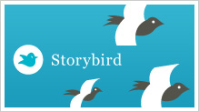

# U1.Storybird

La habilidad de la **lectura y escritura** están presentes en el aula de lengua extranjera de forma continua. Enfrentar a nueestros alumos a textos que les aproximen a la lengua estudiada es parte fundamental de nuestra labor docente. Las Tics nos han dotado de **nuevas herramientas** para crear nuevos materiales que por su propia naturaleza son más **atractivos y significativos** para nuestros alumnos.

La lectura de **cuentos**, o **pequeñas historias**, sobretodo en las etapas de **Educación Infantil** y **Primaria,** es muchas veces el primer paso para introducir contenidos de nuestras unidades didacticas o proyectos. En el aula de **lenguas extrajeras**, solemos usar cuentos para introducir **vocabulario,** **nuevas estructuras** y  acercar a nuestros alumnos a la **cultura del la lengua.**

[**Storybird**](http://storybird.com/) es una  innovadora pero sencilla **herramienta on-line** que nos permite crear y compartir **cuentos o historias**  de forma colaborativa. En principio parace idonea para la etapa de **Educación Infantil**, pero puede ser utilizada también en **Primaria** e incluso en **Educación Secundaria** para convertir a los alumnos en creadores de historias.

Dispone de un banco de **ilustraciones** de **diferentes artistas** con lo que  crear tus propios cuentos con un editor  visual.  La característica más destacada es que estos cuentos pueden ser posteriormente editados de manera **colaborativa** pudiendo ser compartidos a través de la **web 2.0.**

El resultado final de los materiales  son cuentos con una **gran calidad de imagen** y que favorecen la capacidad creativa de nuestros alumnos al tiempo que se hace uso de las TICs, lo que nos proporciona una motivación añadida.

https://youtu.be/T00YjRBIcIw

### CARACTERÍSTICAS GENERALES.

En principio podría parecer que Storybird es simplemente un lugar donde interacalar diapositivas con texto para realizar algo parecido a un cuento desarrollado en un programa de presentación de diapositivas. Sin embargo tiene **varias características** muy interesantes que lo hacen **diferente** de otros creaodores de cuentos virtuales:

*   Esta aplicación es **gratuita**, pero existe una versión de pago que añade ciertas opciones.
*   Permite las  posibilidad de descarga de los cuentos para **impresión en papel.**
*   Podemos **compartir** nuestra obra a través de la **web 2.0**
*   Los cuentos pueden ser **individuales**,o **colaborativos**. Esto significa que da la posibilidad de crear cuentos de forma conjunta con otros usuarios, lo que abre un abanico de posibilidades de **intercacción** con otras aulas o con otros colegios.
*   El **entorno de trabajo** es **muy visual** enfocado a que sean los propios alumnos quienes lo puedan itilizar de forma sencilla.
*   Incluye un **apartado "tour"** en el que da una  **explicación audiovisual** de la aplicación. En ella se explicitan los diferentes apartados que componen la aplicación, la lectura de una obra, los pasos a seguir para crear un cuento y publicarla en la web.

Cabe señalar que los mismos autores especifican el **nombre de su obra** y la e**dad** a la que va dirigida, para conseguir una lectura lo más adecuada posible a las características individuales de los más pequeños.

