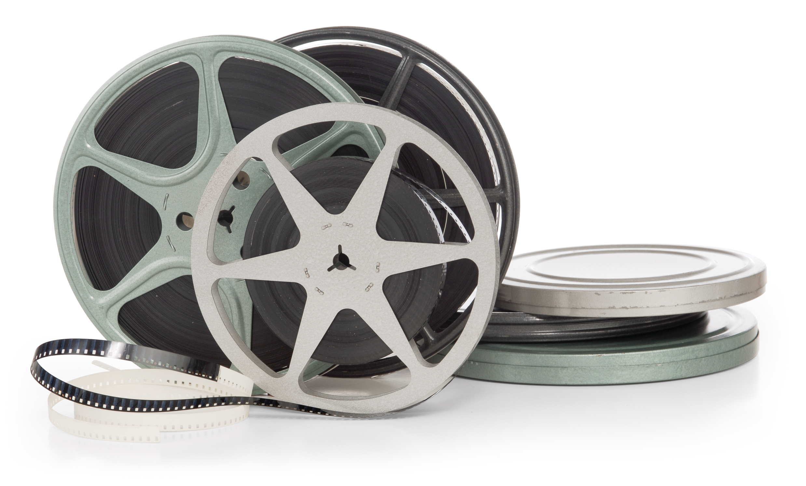

# U2. Programas de edición de video: Movie Maker y Video Pad

En esta unidad te vamos a presentar dos **programas** muy **similares** que están ideados para crear **producciones audiovisuales sencillas** de forma muy **intuitiva**. Ambos son programas que precisan de **instalación**, es decir, no son herramientas 2.0, y  nos proporcionaran un resultado final en forma de **archivo de vídeo** que podremos compartir posteriormente.

Hay una gran lista de **programas gratuitos** o con demos gratis que nos permiten generar producciones de diferente nivel de complejidad. A continuación te ofrecemos un listado de los más destacados actualmente. Algunos de ellos son gratuitos, y otros de pago con demos bastante abiertas.

**[Movie Maker:](http://www.windows-movie-maker.org/es/)** es un software que te permite capturar vídeos desde una cámara, ordenar archivos de películas, insertar títulos, diseñar créditos, efectos, importar imágenes y música

[**Video Pad:**](http://www.nchsoftware.com/videopad/es/) sencillo programa de edicion de imagen con un entorno sencillo, que permite realizar producciones audivisuales de forma fácil.

[**VirtualDub :**](http://www.virtualdub.org/) es una herramienta libre para la captura y edición de video. Presenta funciones muy avanzadas de edición y es compatible con la mayoria de los formatos.

[****Wax:****](http://www.debugmode.com/wax/) herramienta de efectos especiales y corrección de videos.

[**Avidemux**](http://avidemux.sourceforge.net/) :es un editor y conversor de vídeo universal, con soporte para una amplia variedad de codecs y formatos de audio y vídeo

[**Blender:**](http://www.blender.org/) dedicado especialmente al modelado, animación y creación de gráficos tridimensionales.

**[ZS4 Video Editor:](http://www.avs4you.com/es/AVS-Video-Editor.aspx?type=GoogleAdWordsSearch&gclid=CLDz8onE9roCFa3KtAodXnYA6A)** editor sencillo, gratuito y con gran compatibilidad de formatos de foto y video

En esta unidad vamos a profundizar en los dos programas más apropiados para su uso en el ámbito escolar. Ambos se pueden  descargar de forma **gratuita** y  te van a permitir iniciarte en el mundo de la edición de imágenes en movimiento.:

*   **Windows Movie Maker**
*   **Video Pad**

