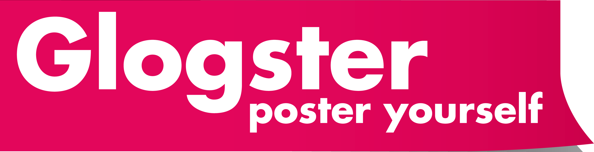

# U2.Glogster

**[Glogster](http://apiedeaula.blogspot.com/2009/08/glogsterando-sin-acentos-ni-n.html)** es una herramienta **web 2.0** que nos permite crear **murales** digitales **multimedia**. Los murales realizados con Glogster pueden ser **insertados en una web** (blog de aula, personal, etc.), proyectados y utilizados en clase mediante una **PDI** o pizarra digital normal como **apoyo** a la presentación de unos determinados contenidos.

Todos recordamos los **murales** que realizábamos de niños en los colegios. Buscábamos textos en libros, imágenes en revistas y periódicos, realizábamos dibujos, etc. con el fin de presentar el resumen de todo lo aprendido relacionado con algún tema de Ciencias Sociales, Matemáticas, etc.

El uso de los murales y los posters sigue siendo habitual en los centros, si bien ya no se utilizan como recurso didáctico con la asiduidad con la que se realizaban en otros tiempos. Sin embargo, no debemos olvidar sus **posibilidades educativas.**

Con la evolución de las TIC, ha se han incorporado a la enseñanza nuevos recursos, especialmente relacionados con los elementos multimedia y la interactividad. Estos recursos enriquecen, aún más, las posibilidades de los murales y los posters. Este concepto ha evolucionado y en la actualidad deberemos incorporar la versión digital de este recurso didáctico.

La palabra **“glogster”** evoca las ideas “global” y “póster”, en referencia a su **funcionalidad** (hacer pósters), su capacidad de mostrar en un mismo documento todo tipo de archivos (audio, video, texto) y su **accesibilidad** desde cualquier lugar del mundo. Al ser una palabra corta, además denota sencillez y rapidez.

Glogster ha generado un vocabulario propio: un póster digital es un **glog** y el autor o autora de un glog es un **glogger.**

Algunas de las herramientas 2.0 tal y como hemos visto en este curso tienen sus propias **versiones especificas para educación**. En el caso de Gloster encontramos la aplicación específica [**Glogser Edu**](http://edu.glogster.com/) que además de ofrecer las mismas posibildades técnicas que la versión general, da la opcion de **gestionar las cuentas de los alumnos**. Esta versión está disponible en modalidad de pago, o en versión demo durante 30 días. Te recomendamos utilizar la **versión normal** de la aplicación.  

https://youtu.be/HiS-Mdm3ZXc

### CARACTERÍSTICAS GENERALES.

*   Su **especifidad**: al ser un programa **especialmente** pensado para **hacer posters** presenta unas herramientas especialmente diseñadas para éste fin.
*   Su **facilidad de uso**: su funcionamiento es bastante **intuitivo** y además cualquier herramienta genera instrucciones en pantalla en el mismo momento de usarla.
*   Su formato digital: **permite probar, corregir, añadir, borrar**...
*   Su **versatilidad**:odemos insertar imágenes, fotografías, video.
*   Su carácter **en líne**a: compartir los posters con otros usuarios..
*   Su **diferentes posibilidades** de implementación : permite imprimir los posters, crear enlaces, utilizar los posters en blogs, wikis y webs,

