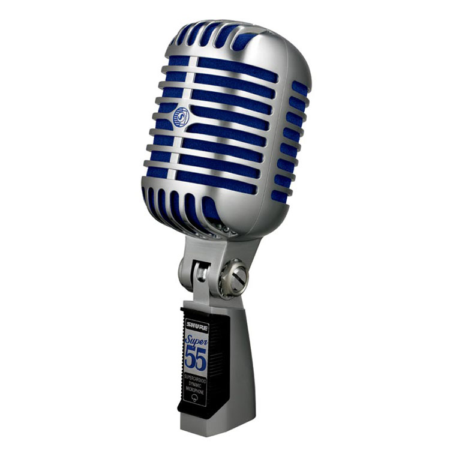

# U.3:Creamos nuestro podcast

F2.16 [www.audiocentro.com.co](http://www.google.es/url?sa=i&rct=j&q=&esrc=s&source=images&cd=&cad=rja&docid=FY7MFQZPAdXfAM&tbnid=9O_h7mxxDRh1aM:&ved=0CAQQjB0&url=http%3A%2F%2Fwww.audiocentro.com.co%2Fproductos.php%3FpageNum_inscritos%3D2%26id_categoria%3D17&ei=mnGEUua_J4nJswak9oCYAw&bvm=bv.56343320,d.Yms&psig=AFQjCNFiwBCDeQ9wwFW9pQK2OeQ7unbHKg&ust=1384497940870919) Licencia Creative Commons

### USOS DE PODCAST PROPIOS EN EL AULA

El formato podcast es relativamente **fácil** de **crear** y de **distribuir** por lo que puede resultar una buena base para facilitar materiales complementarios para los alumnos.

Así se sugieren ideas como:

*   Series de **explicaciones** de conceptos básicos de la materia. Puede servir como material de repaso, para clases de refuerzo educativo, etc.
*   **Audiciones comentadas**, es fácil mezclar diversos materiales musicales o grabaciones con nuestros comentarios.
*   **Audioguías** para estudio de obras de arte, podemos utilizar los podcast enriquecidos para ilustrar la explicación organizando los capítulos por épocas artísiticas, obras, autores, etc.
*   Materiales para alumnos **más avanzados.**
*   Materiales específicos para **alumnos con dificultades**, en particular puede ser útil para aquellos que muestren dificultades de compresión lectora.

*   **Recopilación** de conferencias y charlas realizadas en el centro, con permiso de los conferenciantes y para uso interno del centro.
*   Radio escolar.
*   **Producciones de los alumnos.**

Tal y como hemos explicado, en este curso nos vamos a centrar en la grabación de materiales en las que los alumnos sean los protagonistas, aunque el proceso técnico es exactamente el mismo, independientemente del valor pedagógico que queramos dotar a la actividad-

### **PRIMEROS PASOS**

El primer paso de este proceso consiste en **grabar un archivo de audio.**El formato **más común** para hacerlo es el **MP3**.El proceso de grabación, edición y publicación de un podcast es sencillo.

Estas son las  **herramientas** que necesitaremos:

.\- **Equipo**: Normalmente los podcast se graban desde un **ordenador** provisto de un **programa de grabación** de sonido.Lo más habitual es utilizar la grabadora de sonidos que todos los equipos incluyen. Hoy en dia, cualquier **dispositivo** de telefonia **movil** nos puede servir también de grabadora, puesto que podemos **exportar** el audio a un equipo para editarlo y colgarlo.

.\- **Software específico**: Además de la grabadora de sonidos, y cualquier dispositivo que permita grabaciones de voz, encontramos software **más específico** que además de grabar nos da la opción de editar nuestras grabaciones. En esta unidad te vamos a introducir **Audacity, que es libre y gratuito,** pero debes de saber que hay otros como  Cool Edit que son dos programas de grabación y edición muy sencillos con los que se pueden obtener resultados de calidad.

.\- **Herramientas web 2.0:** Estas herramientas nos servirán **para compartir** el recurso en nuestro blog. Algunas de ellas han sido mejoradas de tal manera que incluso nos permiten realizar la grabación on line del recurso, por lo que el proceso es todavía más directo.

### HERRAMIENTAS

En esta unidad te vamos a presentar **tres  herramientas** diferentes con las que poder realizar las grabaciones con tus alumnos. No son las únicas herramientas, pero sí las más comunmente usadas, libres y sencillas. Es importante recordar, que son **solamente un medio**, y que el resultado final es realmente lo que nos interesa, por lo cual buscaremos siempre la herramienta que nos resuelva de forma **más fácil** e intuitiva la parte técnica de la actividad. 

.\- **Grabadora de sonidos de Windows:**Es una herramienta que podemos encontrar en todos los equipos y que de una forma simple nos permite recoger grabaciones en formato .wav.

.\- **Audacity:**Además de poder grabar en más de una pista, este programa nos permite editar nuestro trabajo. Esto significa que después de tener el material grabado lo podemos retocar, mezclar con otro o hacer nuestras propias mezclas.

.\- **Grabadoras online**: Como hemos comentado anteriormente, las herramientas web 2.0 nos facilitan cada dia más el trabajo, llegando incluso a permitirnos la grabación online de nuestros audios para convertirlos inmediatamente en podcast en la nube de una forma automática.

