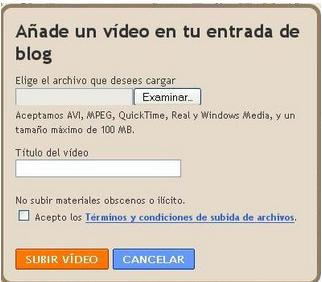
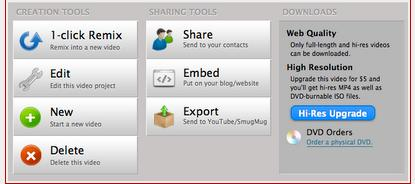

# U.4 Comparto mis videos en el blog

Fig 3.15 [footage.shutterstock.com](http://www.google.es/url?sa=i&rct=j&q=&esrc=s&source=images&cd=&cad=rja&docid=mp1ztTZP9JYq8M&tbnid=OSLYC-X-B4QCUM:&ved=0CAQQjB0&url=http%3A%2F%2Ffootage.shutterstock.com%2Fclip-2750498-stock-footage-software-icons-flow-under-abstract-cloud-server.html&ei=YdGLUvOFKKaa1AWsyYGgAw&bvm=bv.56643336,d.d2k&psig=AFQjCNGt5U5i-O3m6K5KM5Aya8tcP2jE2g&ust=1384981184592691) Licencia Creative Commons

A la hora de **compartir en el blog los videos** que has creado, tendremos que **tener en cuenta** por una parte, el **formato** en el que has creado el video, y por otra el **tipo de  blog** al que lo quieres subir.

Para comenzar hay que diferenciar el **tipo de video** que has creado:

1.- Video creado con **Movie Make**r o **Video Pa**d: En este caso tenemos un archivo de vídeo para **alojar en nuestro blo**g. Es tan sencillo como insertar una imagen, sólo deberás encontrar el botón de **insertar medio** en tu blog.

2.- Video creado con **Aminoto** o cualquier **aplicacion web 2.0**. En este caso no tenemos el video físicamente para subirlo. Hay que utilizar el **código embebido** que generan este tipo de aplicaciones y que será en enlace entre el blog y el servidor en el nube.

Cada **proveedor de blogs** tiene características especiales tal y como estamos viendo a lo largo de este curso. También a la hora de **insertar vídeos**, hay **diferencias notables** entre los tres servidores que hemos ido presentando.

### **BLOGGER:**

**1.- Videos Movie Maker o Video Pad:**

Blogger permite cargar directamente vídeos desde cada una de las entradas.Para ello, nos iremos a la edición de una entrada y pulsaremos el botón situado en la barra de edición. Es importante que estemos en la pestaña **Redactar** para ver la imagen de la carga del vídeo.

Al pulsar el botón **Añadir vídeo** saltará una ventana emergente, en la que tendremos que localizar el vídeo a cargar, le tendremos que poner un título y tendremos que aceptar las condiciones.

        Fig 3.16 Captura propia

Hay que tener en cuenta los **formatos** que admite (AVI, MPEG, Quick Time, Real y Windows Media) y que el **tamaño** máximo del archivo es de 100 MB

**2.- Videos de Aminoto o cualquier herramienta 2.0:**

En el caso de Animoto, que es el que hemos utilizado en este módulo, es tan sencillo como lo siguiente:

Una vez tengas tu video creado, y todavía dentre del **entorno de Animoto**, deberás dirigirte al botón **"video tolbox"** . Allí aparecerá una pantalla como esta:

          Fig 3.17 Captura propia

Como vamos a insertar el video a través de un código embebido, clicaras en **Embed**, y a contiuación **compiarás el código**.

El siguiente paso es **copiarlo en la entradada de Blogger**.

**Muy importante:** Fíjate a la hora de **copiar el codigo** en la nueva entradada. La pestaña del extremo superior izquierdo del post, tiene que estar seleccionada en **"edición html".**

### WORDPRESS

Insertar un video en Wordpress es diferente que en Blogger. En el siguiente videotutorial explican el procedimiento para **embebe**r un video de youtube o de cualquier **servidor de videos externo**, y también como subir un **video propio** a nuestro blog.

