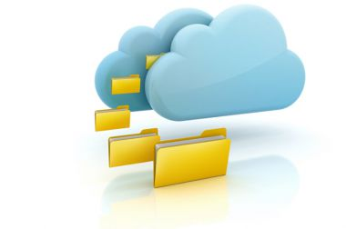

# U.4: Nuestro pod cast en la nube

Fig 2.27  [www.sarenet.es](http://www.google.com/url?sa=i&rct=j&q=&esrc=s&source=images&cd=&cad=rja&docid=hZwA34FUCaUMsM&tbnid=Mj8jTWFxNENFQM:&ved=0CAQQjB0&url=http%3A%2F%2Fwww.sarenet.es%2Finternet%2Fhosting-gestionado%2Fgestor-archivos-nube%2F&ei=PtyIUs2sELGN0wXZmoCACg&bvm=bv.56643336,d.d2k&psig=AFQjCNFF7Iy7F_Aahwh3h-OF8qt2zk0XwQ&ust=1384787370039622) Licencia Creative Commons

Durante todo este módulo hemos estado hablando de la importancia de el **valor expositivo** de nuestras creaciones de audio en el aula de lenguas extranjeras.

Ese valor expositivo es el que tenemos que potenciar a través de actividades en las que el audio no se quede solo en las paredes del aula , si no que traspase y pueda ser **compartido** con el resto de la comunidad educativa y por supuesto con las familiias.

Una vez tenemos los audios grabados es el momento de **convertirlos** realmente en **podcast**, es decir alojarlos **en la nube**. Es es paso final de nuestro trabajo, que le va a dotar de significado y lo va a convertir realmente en una tarea significativa.

### ¿QUÉ SIGNIFICA ALOJAR EN LA NUBE?

También conocido como **Cloud Hosting**, este es el tipo de alojamiento web que se está imponiendo. La nube la forman varios servidores vinculados para formar una sola plataforma. A nivel de usuario, subir en a la nube significa **colgar** nuestras **producciones** en la red, las cuales quedarán alojadas en una red de servidores que nos permitirán **compartirlas**. Otros han definido la nube como una **gran disco duro** virtual, que a parte de liberarnos de espacio en nuestros equipos, tienen otras ventajes muy interesantes entre las que destacamos las siguientes:

*   Todo **Internet** es una **nube**. Los servicios que utilizamos todos los días, como Google, Amazon, Apple, Yahoo, etc .. son servicios residentes en una nube.
*   Las aplicaciones de software en la nube son los programas **más avanzados.**
*   La aplicación **sólo** se utiliza a través de un **navegador.**
*   Desde el punto de vista de los usuarios, el software es **transparente**. El usuario no tiene que preocuparse de donde está instalado el software ni donde se ejecuta.
*   Dispone de procesos automatizados de **copia de seguridad** y recuperación de desastres.
*   **No** hay **licencias** de software.
*   **Dificultad** para un **hackers** para corromper a una aplicación en la nube

El siguiente vídeo nos explica de una forma sencilla y gráfica el concepto metafórico de nube.

### ¿CÓMO SUBIMOS EL AUDIO A LA NUBE?

El proceso es realmente **sencillo**, pero es cierto, que para no olvidarnos de nada, y centrarnos exactamente en lo que vamos a comenzar a hacer es conveniente aclarar una serie de conceptos.

Cuando subimos nuestro audio a la nube...

*   Estamos **compartiendo** el recurso de forma ilimitada.
*   Nuestro archivo va a estar disponible **online.**
*   Necesitamos de un **proveedor de servicio** que nos permita alojarlo.
*   Una vez alojado en un servidor, **podemos** incorporarlo a nuestra **web o blog.**
*   Utilizaremos un **código embebido** que se gererará automaticamente y  que hará de **enlace** entre el alojamiento principal, y el blog o sitio web dond efinalmente lo queremos alojar.

Por lo tanto lo que tenemos que hacer en **primer lugar** es buscar un **aplicación** que nos permita alojar nuestro audios en la nube. Entre otras encontramos [Puentes al Mundo](http://puentesalmundo.net/), [Ivoox](http://www.ivoox.com/) , [Radioteca](http://radioteca.net/), [Kid Cast.](http://kid-cast.com)

En esta unidad te recomendamos por su facilidad de uso y prestaciones:

[**1.- Poderato.com**](http://www.poderato.com)

**[2.- SoundCloud.](https://soundcloud.com/)**

En ambos casos los procesos de registro y utilización son **muy sencillos**, de hecho destacan por su uso **intuitivo** y su **facil manejo**. En la siguiente parte de la unidad, te presentamos las dos herramientas de una forma más detallada.

