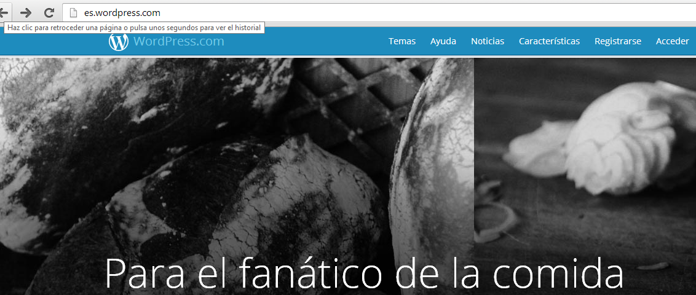
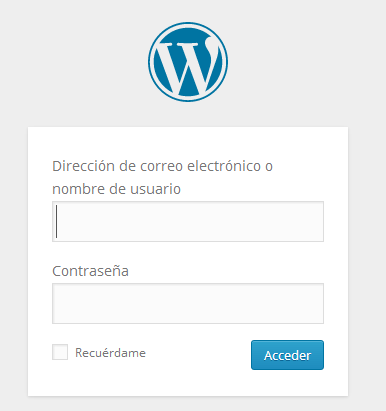
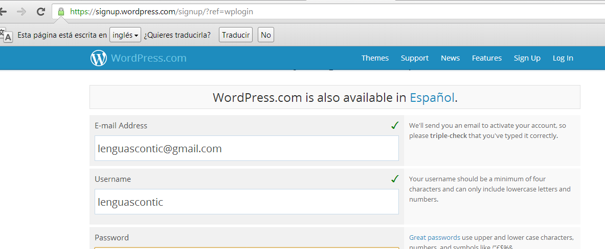

# Wordpress

 **WordPress.com** es un sitio y servicio web el cual fué fundado por Matt Mullenweg en el año 2003. Este servicio le permite a sus usuarios **crear blogs** gratis con gran **facilidad**, el sitio es muy similar a Blogger.com, simplemente creas una cuenta, eliges un subdominio, y luego empiezas a añadirle información a tu nuevo blog.Las causas de su enorme **crecimiento** son, entre otras, su licencia, su **facilidad de uso** y sus características como gestor de contenidos. También una de las causas, es su enorme comunidad de desarrolladores y diseñadores, que se encargan de crear plugins y themes para la comunidad.

[Para](http://registrarseen.com/wordpress/#) empezar a utilizar esta excelente plataforma de blogging, la cual ademas es considerada hoy en dia la más grande y la más utilizada por millones de bloggers en todo el mundo, lo primero que debes hacer es **crear una cuenta**, si no sabes como hacerlo simplemente sigue los pasos a continuación.

###  COMENZAR EN WORDPRESS

¿Como empezar en wordpress?

1\. Ve a la página de **registro** en español ubicada en la siguiente url: https://es.wordpress.com/signup/

En la página principal de wordpress clicamos en el menú **"acceder"**

En esta pantalla tenemos que registrarnos como **usuarios** de wordpress.

 

Completaremos los datos que nos solicita. Es importante que compruebes que el **correo electronico** que facilitas está correctamente escrito, puesto que la fase final del proceso dependerá de la **verificación del servicio** a través de esa cuenta de correo.

También es muy importante la dirección que le des al blog, puesto que será la forma de entrada al mismo. Una dirección sencilla y fácil de trascribir y recordar es fundamental.

 Para **finalizar** el proceso, Wordpress te enviará un **correo de confirmación** en el que se incluirá un **enlace** que te permitirá comenzar a publicar y accederás al entorno de edición de tu blog.

A partir de este momento ya disponemos de nuestro blog en wordpress.

### **TUTORIAL**

En el siguiente enlace te facilitamos un **sencillo ** manual de usuario de wordpress  para que empieces a familiarizarte con la herramienta y puedas consultar las dudas que te vayan surgiendo al relizar las tareas.

[Manual Wordpress en dos patadas](http://facilytic.catedu.es/2013/04/11/manual-sencillo-de-wordpress-parte-1-2/)

 [Manual Wordpress en dos patadas 2](http://www.catedu.es/facilytic/wp-content/uploads/2013/04/Manual_WP_2.pdf)

Fig. 1.42 Manual Wordpress en dos patadas 1  Captura de pantalla

[Manual Wordpress en dos patadas 3](http://facilytic.catedu.es/wp-content/uploads/2013/05/Manual_WP_3.pdf)

